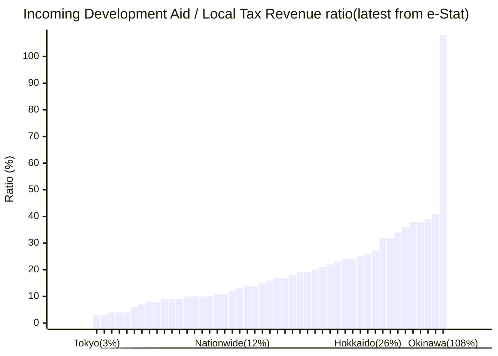
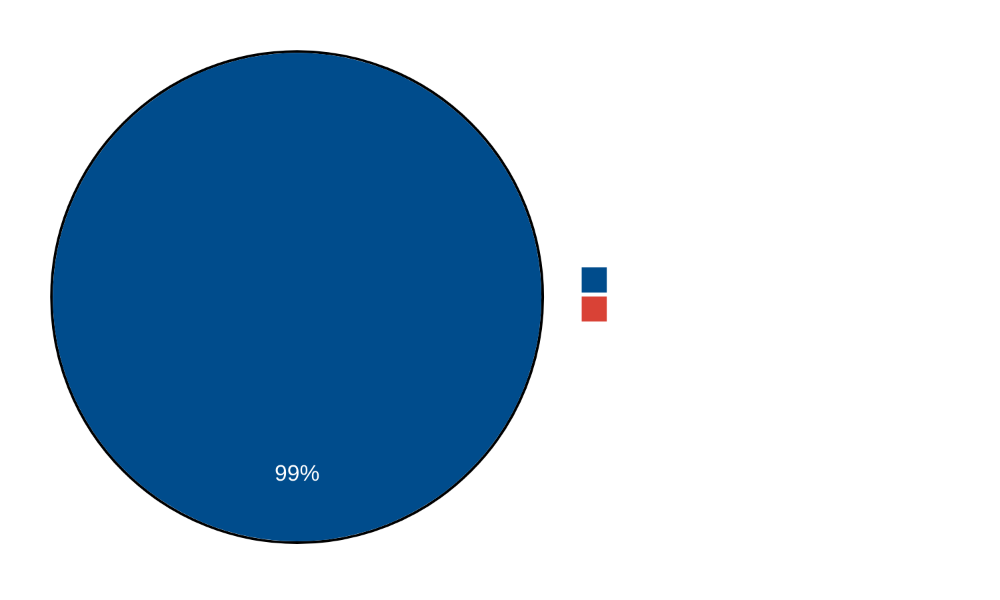

[https://lisiki-jp.github.io/okinawa_gametheory/](https://lisiki-jp.github.io/okinawa_gametheory/)  

# **Succeeded at failing: Why Okinawa is the poorest prefecture after 14.8 Trillion Yen aid. From a perspective of game theory.**
© 2025 伊波りしき. This work is licensed under [CC BY-SA 4.0](https://creativecommons.org/licenses/by-sa/4.0/).

Based on selectorate theory, game theory, resource curse, aid curse, incentive analysis, and rational choice theory.

---
## Key data
### Reality-bending dependency
Naha politicians' optimal financial strategy is vastly different from that of other prefectural governors.  
Naha has relatively small incentives to take care of the local economy, or a healthy local society that produces tax revenue.  

(Fukushima, 95%, is omitted because of the meltdown recovery.)
[Explanation and full data here](#okinawa-is-the-permanent-disaster-zone-financially)    

---
### Okinawa local media's political narrative dominance: 99.43%

National papers are invisible.
Nikkei was excluded because of a narrative comparison on politics. 
[Explanation and full data here](#estimation-of-okinawa-local-newspaper-market-share-9943)    

---
### Actions and statements are not aligned
The three players in the Henoko project show the behavior not align with their stated intention.  
Let's explore their logic behind it.  

| Player                 | Stated Goal (What they SAY)           | Current Strategy (What they DO)                       | SAY and DO align? | Current Goal (What they WANT; estimated from observing)                                        | 
| :--------------------- | :------------------------------------ | :---------------------------------------------------- | :---------------- | :--------------------------------------------------------------------------------------------- | 
| **US Regime**          | Ensure regional stability             | Apply consistent pressure to Japan                    | **YES**           | **Status Quo** (Functional base & geopolitical "tripwire", keep Japan dependent on US)         | 
| **Japan Regime**       | Resolve the "Futenma danger"          | Contain the issue to not spread into the majority Japanese voters; run an impossibly slow project     | **NO**            | **Status Quo** (Alliance managed, secure political position, keep Okinawa dependent on Tokyo)  | 
| **Okinawa Regime**     | Stop the base                         | Appeal to anti-base voters without effective action   | **NO**            | **Status Quo** (Maintain secure political position)                                            | 
| **Okinawa Newspapers** | Reflect the public will               | Focus on ineffective narratives; localize the problem | **NO**            | **Status Quo** (Protect monopoly market)                                                       | 
| **Japan Newspapers**   | Inform the public objectively         | Provide periodic, low-key coverage                    | **Partially**     | **Status Quo** (Safest, low-cost option)                                                       | 
| **Japanese Citizens**  | (No single consensus)                 | Remain largely passive and disengaged                 | **N/A**           | **N/A**                                                                                        | 
| **Okinawa Citizens**   | Stop the base                         | Engage in localized, direct protest                   | **YES**           | **Solve** (Stop the base)                                                                      | 

---
# Table of Contents

* TOC
{:toc}

---

# 1: "The money you sent to Okinawa is for the Okinawa economy growth."
Every year, Tokyo hands Okinawa about 300 Billion Yen. They call it the "Okinawa Promotion Budget."
It's been over **50 years**.  
The total became roughly 14.8 Trillion Yen.  
The result? Okinawa is the poorest prefecture.  
Other prefectures don't get this special budget, and they are doing much better than Okinawa.  

Let's say you give a massive allowance to your child every day, and now the child is 50 years old and has no skills to earn money.  
The only thing he knows how to do is spend money.
Whose fault?
It's our fault. We have to stop this.  

### Aid Curse: good things sometime hurt local development
This phenomenon is well known among politicians and academics. It's called "Aid Curse". (a variant of the Resource Curse)
The observation became famous in "Dead Aid: Why Aid Is Not Working and How There Is a Better Way for Africa" by Dambisa Moyo, published in 2009.  
This book fundamentally changed the public debate on development by arguing that systemic government-to-government aid has been a "curse" rather than a blessing for African countries.  
This Resource Curse(Aid Curse) doesn't have a single mechanism. It can be economic, political, or ideological reasons. The important point is that what is supposed to be "good"(e.g., aid or natural resources) can act as a negative factor for growth.  

I'll explain a simplified version that fits for Okinawa case. The mechanism here is that they don't develop industry because they don't have to. Because if aid provides money, why do they have to earn money? 
Or even it's better not to develop the economy. Because if they become rich, the aid ends.  
It's similar to why we Japanese are not excellent at English. Because our economy is big enough for us not to learn a foreign language. We don't have to.  
So, like we don't learn English, Okinawa doesn't develop industry.  

Have you ever heard of the Yubari city economic collapse?
That's "aid curse" in working. Tokyo sends massive aid to compensate for its energy policy shift that would hurt the coal city. And Yubari spends that money to build the massive tourism infrastructure. But aid was one-time, and the running cost of the tourism facility was on Yubari. And they went bankrupt.  
If Tokyo didn't send the aid, Yubari didn't crush that hard.  
This was city-level and short-term.  
Okinawa is a **prefecture-level** and has been **over 50 years**.  
Yes, Okinawa is Yubari, but worse, and bigger. They haven't gone bankrupt yet because Tokyo is sending our tax money to cover the deficit.  

The reason why does Tokyo do this?
Tokyo got the switch to ruin Okinawa.  
"If you don't obey, I can make you bankrupt by just stopping the aid."
The money is sent to make Okinawa poor and dependent. So Tokyo can control Okinawa. (e.g., bases)
"Okinawa Promotion" is a facade.  

### Conclusion: Stop the aid.  

* The aid is hurting the Okinawa economy rather than developing it.  
* 14.8 Trillion Yen created the poorest prefecture in Japan.  
* Aid is taking away the reason to develop the local economy in Okinawa.  
* Okinawa is big Yubari. It built tourism infrastructure using aid from Tokyo and creating the deficit. 

---
# 2: "This is the cost of National Security. We have to pay it."

If this is about National Security, we shouldn't pay 300 Billion Yen to Okinawa.  

### We are losing the war before it even begins. 

Modern war is decided by how many missiles you stockpile.  

With 300 Billion Yen, you can buy **1,000 Tomahawk long-range missiles**. That amount can decide a war outcome. And we have been wasting it for over 50 years. Every year.  
Or you can even build missile factories. We could've helped Ukraine indirectly. They need the help desperately; their innocent citizens are dying because they lack missiles. And we are wasting 1,000 long-range missiles in front of them. Every year.  

From a military economic perspective, Okinawa is one of the absurd "military spending" in history. 
It's **Military Suicide**.  

We are losing the war before it even begins.  
We are scraping the bottom of the barrel to find money for defense, our taxes are rising, while burning 300 Billion Yen to build "deficit infrastructure" in Okinawa.  
And while we are wasting our tax money, China has stockpiled 3,000+ ballistic/cruise missiles. Which roughly 2000 can hit Tokyo. 
Japan only has roughly 1500 interceptors. 
In this gap, even in the best scenario, 1,000 to 1,200 can hit Tokyo. We can't intercept them mathematically.  
The gap in total military prowess is widening. And when this ratio becomes large enough, China will have confidence to act.  

### National Security Negligence by Tokyo's politicians

And if this is truly about National Security, why is it even up for debate?
If the bases are essential for Japan's survival, allowing them to be blocked by local politics is a **crime against the nation.**

I am not talking about a crime by the Okinawan people. They are acting within their rights.  
I am talking about the **Crime of the Politicians in Tokyo.**

National Security is the one thing that cannot be negotiated. It is the sacred duty of the State.  
Yet, our politicians have created a legal system where a single local mayor can hold the entire nation's safety hostage.  
They have effectively legalized the disruption of our National Defense.  

You do not ask for "permission" to put out a fire. You do not negotiate whether to lock the front door.  
To treat National Survival as a "local petition" is not Democracy.  
It is a **dereliction of Sovereign Duty.**

The current situation doesn't make sense if the money is about National Security or "rent".  
As we learned in "1", this is the money to keep Okinawa weak and dependent.  

Let me repeat the current situation because it's so absurd:
**This 300 Billion Yen is not buying Security. It is buying Vulnerability.**

### Poverty is a hole in our armor: Vulnerable to Chinese influence
A poor, resentful population that relies on Chinese tourists or Chinese imports/exports is a population that can be manipulated by China.  
China doesn't need to invade with tanks; they just need to turn off the switch, and the economy will collapse.  
China can even blackmail to change sides. That is happening in other Pacific islands like Palau. Where the US is doing the "dependency" strategy.  

By keeping Okinawa weak and dependent, and resentful, Tokyo is practically **gift-wrapping** the island for influence operations.  

**True National Security is not a weak dependency.**
**True National Security is rich citizens and missiles.**
A rich, industrial, self-sufficient Okinawa that doesn't need Tokyo's money—and doesn't need Beijing's tourists—is the ultimate defense.  

We are spending 300 Billion Yen a year to maintain a weak point in our armor.  
That isn't "Defense Spending." That is **Defense Undermining.**

### Conclusion: Stop the aid.  

* Because the aid has a negative effect on national security.  
* Tokyo's politicians are neglecting their duty by enabling the local politicians to disrupt national security.  
* It's creating a vulnerability while consuming precious resources.  
* Let's get more missiles so China will think that it'll be costly to attack us. 

---
# 3: "Politicians of Tokyo want to improve the economy of Okinawa."

You already know Nagata-cho actually wants the opposite, weak Okinawa. So they can be controlled.  
Here, we will explore **why** they want **absolute** control so badly. 
They are not stupid. They know they could buy 1,000 long-range missiles every year for that money. 
But they choose to weaken Okinawa, why? **What could be worth that amount of missiles?**

You might have guessed it, the bases.  
You could be wrong.  

Nagata-cho's fear is deeper than that.  
The real reason they spent so much to ensure a weak Okinawa is to prevent **Okinawa independence**.  

### Rich = Independence ?: Catalonia case

Have you ever heard of Catalonia?
It's a part of the eastern coast of Spain where the beautiful Mediterranean city of Barcelona is located. Sagrada Família is there.  
And they have the Catalan independence movement.  

The reason? **because they are rich**.  
Because they are rich and pay more taxes than other parts of Spain, they thought that if they got independence, they could pay less tax.  
They even held the referendums on independence. 

And, Catalonia has been Spain for over 600 years. And that was a relatively peaceful process of political marriage.  
Okinawa has been Japan for roughly 150 years, if we count from 1879. The annexation of the Ryukyu Kingdom. 

So, if Okinawa becomes rich?
And if they get independence and switch sides?

It's the end of Japan's security. Important trades are going through near Okinawa.  
The entire Pacific becomes a potential war zone because Okinawa is part of the "First Island Chain" that prevents the Chinese fleet from going Pacific.  
Without maritime control, we have no future. We have no food. No oil. No resources. The stock price will vanish in one night. 

This is the fundamental fear of Nagata-cho.  
This is why they want a weak and dependent Okinawa. 

### Preparing for the worst, we end up in a worse position

The ruling party is not only a politician. They are the commander of the military.  
The military has a **duty to prepare for the worst.**
And the worst is "the Okinawa independence" and independent Okinawa switches sides to China.  

This is why. **It's their duty to weaken Okinawa**. Or at least that's what they likely thought.  

**If the world consisted only of Japan. The dependent Okinawa plan is perfect.**
But the world is not only Japan. And we have a **non-democratic China now richer than Japan**.  
50 years ago, the plan might have looked perfect. But today, it looks catastrophic.  
As I explained in "2/Poverty is a hole in our armor", poor citizens are vulnerable to influence from China.  

Nagata-cho succeeded in securing a favorable economic balance between Okinawa and Tokyo by weakening Okinawa. But that's also shifting the economic balance between Okinawa and Beijing.  

Yes, preparing for the worst, Nagata-cho is stepping closer to the worst. 
And during the process, Japan was weakened because it was spending money to weaken Okinawa. While **China got weak Okinawa for free.**

Did Tokyo plan the forever dependency plan 50 years ago? Maybe, maybe not. **It doesn't matter**.  
Nobody in the ruling party will tell you "We had". And they are the only ones who know the truth. 
It might even the LDP doesn't know about this. It's been a long time. The initial members have gone.  

But I'm sure after 2010, when the Aid Curse became the common knowleadge among political elites, Tokyo has been sending aid with the intent.  
Whether it is started intentionally or not, the result is the same. The machine is wasting our money today.  
Bureaucrats in Tokyo are happy because they control the island with money. As long as voters don't notice the mechanism.  
Politicians in Okinawa are happy because they can expoit the anger to win election.  
It is a 'Perfect Crime' where no one has to be the villain, but everyone is an accomplice.  

### Solution: Democracy Armor.  

My solution is this: Make Okinawa love **democracy** and make them wealthy as mainland Japanese.  
What **China will never be able to give Okinawa is democracy**. And we have that. 
Okinawans will never get the majority in geopolitics. **A good democracy that can reflect the minority's will is the only answer** for their prosperity.(This is historically proven; we will learn about it in the history chapter in this report.)  
**We can provide that, and China can't.** 

But currently, we are failing to do that.  

Look at Taiwan. They speak Chinese. But they are fighting fiercely to protect their democracy.  
Because they love democracy. It's precious. It's hard to come by. We often forget that because we luckily have that from birth.  
Also, they are rich; communist China could confiscate their asset. That's unthinkable for Taiwanese.  

People of Okinawa have no great memory of democracy. (Actually, they had been benefiting from it massively.)
They vote for anti-bases, and politicians achieve nothing.  
That's all they know about democracy.  

Because of that, We must give them a memory of a good democracy that actually cares about them and improves their life.  
Okinawa stays in the team democracy if it likes democracy.

And this is why you are reading this. **We are the only ones able to deliver a good democracy for Okinawa**. 
Democracy is about the majority. Okinawa has only 1.2% of the population of Japan. They never get the majority if their interests conflict with other prefectures.  
And they have been **directed to conflict** with other prefectures.  
The only people who can bring a good democracy to Okinawa are mainland Japanese, **you**.  

### Why we stand against Tyrannical China

Besides, if we use democracy as a tool to ignore the minority. How can we stand proud against China?
I'm not satisfied with the phrase "Protect the Status Quo" that politicians love to use. 
What if "Status Quo" is wrong?
We, Japan, need the confidence that we are on the right side. 
After all, how can we say we aren't an American client state that is manipulated to fight against fellow Asians, the Chinese?
We will show China, the USA, and the rest of the world that democracy matters. And the Japanese will matter.  

### Good democracy is what keeps us safe and protected.  
There is a strong positive correlation between egalitarian democracy and Life Expectancy. 

**The Evidence:**
1.  **V-Dem: Interactive Maps**
    *   [https://v-dem.net/data_analysis/MapGraph/](https://v-dem.net/data_analysis/MapGraph/)
    *   *Instruction:* Select "Indicators" and search for **"Egalitarian Democracy Index"** (v2x_egal).  
    *   Egalitarian Democracy Index: "To what extent is the ideal of egalitarian democracy achieved?"  
2.  **Life Expectancy by Country 2025**
    *   [https://worldpopulationreview.com/country-rankings/life-expectancy-by-country](https://worldpopulationreview.com/country-rankings/life-expectancy-by-country)

When you compare the maps, you will see that the "Egalitarian Democracy" score translates almost directly into Life Expectancy. 
You live long because we have a good democracy. 

"Good Democracy" and "Life Expectancy" have a structural relationship. You can refer to the papers (by BDM) I cited at the end of this report.  
In short, a "large winning coalition(functioning democracy)" demands "public goods(life expectancy)", and rulers have to fulfill the demand to stay in power. 
1. A functioning democracy creates a large number of people the ruler has to satisfy to get/stay in power. (the group is called Winning Coalition, or just W) 
2. The ruler has to spend national resources to distribute good things(Public Goods) to them(W) to keep them satisfied. (like health care, social security, a fair economy)
3. Otherwise, oppositions will promise "a better deal" to people, and the ruler loses power.  

This explains why the US has low life expectancy despite its wealth. Because they only have two parties (practically only the two parties are allowed in laws), they don't have to compete with "Good Idea". 
The US politicians are competing in "How bad(how little distribute good things)" they can go. Because that will maximize politicians' share (and corporations that give politicians money through lobbying: legalised bribery).  
They just need to be slightly better than their opponent.  
This structure, with only two entities in the system, is called "Duopoly", which the Okinawa local media is. By a 99.4% share.  

Bonus:
You can search "Egalitarian component index" in V-DEM. This index acts as a scoreboard for how "Good Things" (resources) are actually distributed.  
*   **The Contrast:** While the US lags, countries like **Japan, Germany, and the Nordic states** score very high.  
*   **The Structure:** These countries have achieved an egalitarian society (and high life expectancy) because their political systems force leaders to serve a larger coalition.  

#### Bonus: Nationalism is a free public goods.  
Why does Okinawa have strong "Nationalism"?
Because it lets politicians secure power without distributing any goods. 
The economy has never developed. Politicians have no good thing to provide. Or they don't have to provide because it has strong nationalism.  
The only thing they have to offer is a story that keeps people angry with the outside world. That lets politicians win votes and stay in power. 
Just like Russia does.  

#### Bonus: WW2 winners die early. Losers live longer. Because they have to distribute real "good".  
The US, Russia, and China have strong nationalism as "The Winner of WW2". This let them satisfy the people with just a "memory". Rulers can neglect to satisfy it's people.  
Germany, Japan, and Italy had to distribute the real public goods to satisfy it's people, because they have no good memory of Nationalism.  
You can see that the WW2 winners have low scores on the "Egalitarian component index", and all losers have a high score on it.  
The UK and France are between the two groups. Because they are "Officially the winner, but practically the loser" of WW2. Their colonial empire collapsed because of the war.  
Yes, Japanese can live longer than US citizens because we lost WW2.  

Sometimes, people say “The Japanese can't have Nationalism”, like it's a bad thing.
The data shows that having no Nationalism is good for your health. We are lucky to not have one.

### Conclusion: Stop the aid.  

* It's a tool for control that is outdated and doesn't fit the current situation.  
* Giving good democracy is the best way to make Okinawa in team democracy. And only you, Japanese, can do that.  
* Democracy is good.  

---
# 4: "Politicians of Naha want to improve the economy of Okinawa."

Because tax revenue from the Okinawa economy is so tiny compared to money from Tokyo, they have zero, even negative, incentive to develop the local economy.  
That's why they are obsessed with outsiders(where money comes from), but rarely provide real improvements for the people of Okinawa.  

You might be wondering: *"Why are they so incompetent?"*
You ask: *"Why, after 50 years and 14.8 Trillion Yen, have they failed to build a strong industry?"*
You assume they are trying to succeed but failing.  

No. **They are succeeding at "Failing."**

"Wasting the aid money".  
You call it failure, politicians in Naha call it success.  

Let's start with data.  

### External Development Aid vs. Local Tax Revenue: Okinawa anomaly(108%; national avg 12%)

| Prefecture | Local Tax Revenue | Development aid | aid/tax ratio |
| :--- | :---: | :---: | :---: |
| **沖縄県 (Okinawa)** | 147,904,573 | 159,135,659 | 108% |
| 福島県 (Fukushima) | 270,982,365 | 257,156,091 | 95% |
| 熊本県 (Kumamoto) | 201,888,053 | 82,986,333 | 41% |
| 鹿児島県 (Kagoshima) | 180,084,010 | 69,750,007 | 39% |
| 長崎県 (Nagasaki) | 142,807,843 | 54,093,986 | 38% |
| 宮崎県 (Miyazaki) | 123,635,388 | 46,382,820 | 38% |
| 岩手県 (Iwate) | 155,951,549 | 55,475,489 | 36% |
| 秋田県 (Akita) | 113,824,612 | 39,042,944 | 34% |
| 島根県 (Shimane) | 80,604,106 | 25,640,722 | 32% |
| 鳥取県 (Tottori) | 66,401,665 | 21,045,802 | 32% |
| 高知県 (Kochi) | 79,904,593 | 21,763,345 | 27% |
| 北海道 (Hokkaido) | 695,812,140 | 177,861,442 | 26% |
| 大分県 (Oita) | 137,654,929 | 33,917,378 | 25% |
| 山形県 (Yamagata) | 131,492,453 | 32,044,570 | 24% |
| 和歌山県 (Wakayama) | 108,128,102 | 25,756,170 | 24% |
| 佐賀県 (Saga) | 100,802,437 | 23,612,126 | 23% |
| 青森県 (Aomori) | 167,954,955 | 37,689,562 | 22% |
| 新潟県 (Niigata) | 291,298,597 | 62,373,599 | 21% |
| 宮城県 (Miyagi) | 335,182,778 | 68,012,708 | 20% |
| 徳島県 (Tokushima) | 92,577,230 | 17,962,979 | 19% |
| 福井県 (Fukui) | 120,537,658 | 22,435,625 | 19% |
| 富山県 (Toyama) | 148,625,171 | 26,105,147 | 18% |
| 山口県 (Yamaguchi) | 180,715,192 | 31,377,753 | 17% |
| 山梨県 (Yamanashi) | 114,451,378 | 19,037,293 | 17% |
| 奈良県 (Nara) | 146,746,601 | 23,092,675 | 16% |
| 石川県 (Ishikawa) | 163,880,011 | 24,913,105 | 15% |
| 愛媛県 (Ehime) | 166,509,638 | 23,961,212 | 14% |
| 香川県 (Kagawa) | 135,107,965 | 18,301,151 | 14% |
| 岐阜県 (Gifu) | 266,772,434 | 34,175,782 | 13% |
| 全国 (Nationwide) | 20,542,834,702 | 2,367,416,672 | 12% |
| 三重県 (Mie) | 260,275,786 | 29,277,433 | 11% |
| 長野県 (Nagano) | 274,773,737 | 29,563,329 | 11% |
| 福岡県 (Fukuoka) | 660,081,826 | 68,473,548 | 10% |
| 岡山県 (Okayama) | 251,618,522 | 25,236,840 | 10% |
| 広島県 (Hiroshima) | 386,249,528 | 37,552,693 | 10% |
| 京都府 (Kyoto) | 334,538,245 | 31,961,897 | 10% |
| 滋賀県 (Shiga) | 190,095,235 | 16,958,990 | 9% |
| 栃木県 (Tochigi) | 289,130,264 | 25,769,367 | 9% |
| 群馬県 (Gunma) | 275,828,373 | 23,685,511 | 9% |
| 千葉県 (Chiba) | 820,359,033 | 68,477,592 | 8% |
| 兵庫県 (Hyogo) | 723,040,976 | 55,549,819 | 8% |
| 茨城県 (Ibaraki) | 411,107,290 | 28,548,202 | 7% |
| 静岡県 (Shizuoka) | 556,619,879 | 36,133,748 | 6% |
| 埼玉県 (Saitama) | 895,524,715 | 39,895,493 | 4% |
| 愛知県 (Aichi) | 1,231,373,367 | 54,745,560 | 4% |
| 大阪府 (Osaka) | 1,328,869,569 | 55,471,195 | 4% |
| 神奈川県 (Kanagawa) | 1,295,865,290 | 40,968,709 | 3% |
| 東京都 (Tokyo) | 5,289,244,641 | 164,043,271 | 3% |

(**Data Source:** e-Stat. FY2017 Settlement: the latest available on e-stat) [https://www.e-stat.go.jp/dbview?sid=0003173301](https://www.e-stat.go.jp/dbview?sid=0003173301)    
(**Unit:** Thousands of Yen)  
(Development aid = Natl. Treasury for Construction + Others; 国庫支出金:普通建設事業費支出金 + 国庫支出金:その他)

### Okinawa is the "Permanent Disaster" Zone (Financially)
*   **Fukushima 2nd (95%) & Kumamoto 3rd (41%):** These prefectures are high on the list because of **major disasters**.  
    *   Fukushima: Ongoing recovery from the 2011 Earthquake/Tsunami/Nuclear disaster.  
    *   Kumamoto: This data is for FY2017. Kumamoto was hit by a massive earthquake in **2016**. They were in peak reconstruction mode.  
*   **Okinawa (108%):** There was no massive natural disaster in Okinawa in 2017. **This is their "normal."**
    *   Okinawa is receiving *more* aid relative to tax than a prefecture recovering from a nuclear meltdown.  

*   **National Average:** **12%**.  
**Okinawa (108% ) is 9x the National Average.**

**Okinawa operates under a completely different set of rules** than the rest of Japan.  

And remember, this doesn't even include the Local Allocation Tax for salaries/operations, Social Security, or military rent. This is just the "Building & Development" money.  

I did the same with the 2000 data.  
Again, Okinawa is the 1st (183%). And Tokyo at 48th (6%).  
Fukushima (26th) and Kumamoto (20th). This aligns with disaster relief hypotheses.  
National avg (32%), so I guess we were building infrastructure harder in 2000 than in 2017.  
Since the Okinawa Promotion budget is not shrinking, and building infrastructure seems down trend, the 2025 data is likely to have a more stark Okinawa anomaly. (Please update e-Stat. Dear govt)

### Naha politician's optimal financial strategy: Keep Okinawa poor for Money Begging 
What data tells you is this.  

* If Tokyo gets the double Development Aid relative to the current amount received from Nagata-cho.  
It would gain only 3% of the tax revenue. "It's not worth the time; let's develop local industry."

* If Naha gets the double  Development Aid relative to the current amount received from Nagata-cho.  
It would gain 108% of the tax revenue. "This is the oil field!. **Let's forget the local economy, keep it poor to get more aid.**"

It's the optimal choice for Naha politicians to neglect, or even structurally undermine, the local economy by misdirecting development targets.  

That table perfectly explains why Naha is so obsessed with outsiders and complains about everything outsider does.  
It's an optimal business strategy.  
Every time they complain, it can raise the possibility of higher aid as compensation.  
It's the best way to get money.  

### Not only that. Success is a Threat to the "Resistance": Politicians/media will lose their jobs. 
Imagine a politician in Okinawa who takes the 300 Billion Yen, invests it perfectly, and builds a booming Tech Industry.  
Okinawa becomes rich. The youth have high salaries. They buy their own houses. They stop caring about the "Tragedy of the Past" and start focusing on the "Luxury of the Future."
They realize that cooperation with Tokyo pays off.  

**What happens to that politician?**
He loses his job, which is secured by his anti-Tokyo stance.  
He loses the "Victim Narrative."
He loses the excuse to demand next year's 300 Billion Yen.  
The "Anti-Base" movement dies because people are too busy being rich.  

**In the current system, Economic Success is Political Suicide.**

### The Art of Wasting Money: Let's waste money that can develop local industry.

Why do they build useless concrete boxes? Why do they pave roads that don't need paving?
Why does the poorest prefecture have the longest fee-free bridge that has a massive maintenance cost? 

If they build something *useful* and *permanent* and *profitable* (like a high-tech industry or a university), the people will have to say: *"Tokyo helped us build this."*
The physical evidence of Tokyo's help remains. Gratitude grows. Nationalism dies. 

That's why they say the bridge is "The victory, we won it from Tokyo for our suffering."
They are reframing everything as looking good by "Because Tokyo did/do bad". 
Its balancing mechanism and good things that come from Tokyo actually can accelerate the "Tokyo is evil" narrative.  

There is an even better way.  
**But if they WASTE the money?**
Why did the 14.8 trillion yen aid not produce an effect?

1.  **The Money is consumed.** (The cronies get paid).  
2.  **The Evidence vanishes.** (There is no lasting asset to thank Tokyo for.)
3.  **The Poverty remains.** (So they can claim "We are still victims!").  
4.  **The Aid continues.** (Because we need more money, because still poor).  

**Inefficiency is not a bug. It is a feature.**

Think about it, what is good for Naha's politicians, they can get a good thing from making the Okinawa economy good?
If Okinawa becomes rich, ruling politicians in Naha will lose jobs.  
The local media is the true engine for their power, they too lose it's main reason to dominate the narrative.  

### The malfunctioning tourism industry is beneficial for politicians
(how malfunctioning is explained in: "9")  
This also explains the 50-year obsession with Tourism.  
Why Tourism?
And why don't they change the strategy despite a 50-year continuous failure?

Because they are "successfully" failing to create a real industry.  
It's the optimal choice for politicians and media.  
Successful industry = no aid.  
Successful Okinawa = no resentment = no media dominance.  

Tourism is their 'Trash Bin'. As shown in "9"(later chapter), it generates a fraction of the profit of military rent and has a disastrous ROI. It doesn't produce real wealth.  
It just burns aid money.  
And Naha politicians and local media are all happy.  

### Not only the Aid Curse and Nationalism: here is the Budget trap

In "1", we learned about the Aid Curse, that aid takes away the need for Okinawa to develop industry.  
In this chapter, I talked about the Naha politicians' incentives and why they want to waste the aid.  

And that's not all, we have more factors that hinder the Okinawa's development. 
We will explore the budget nature of the Okinawa aid.  

If you have ever worked inside a large organization, you know that "You have to spend the entire budget for this year".  
Why? Because if you don't spend it, next year you get less money. 
The distributor will think, "You didn't spend all the money last year, you didn't need that money, so I assume you don't need it this year, too."
You spent the budget even though you know it's an inefficient way to spend money. 

"Okinawa promotion budget" is the same.  
Okinawa has to spend every yen even if it will produce nothing.  
Actually, it's even better to create a negative result by building infrastructure that creates maintenance costs.  
Because if a real deficit is there, Okinawa can ask for more of the budget next year.  

Again, they are successfully "failing".  

### Unclear Okinawa role: Hokkaido has a clear role.  

The current special budget ignores the existence of Okinawa's agency and its economic challenges. 
We pour our tax to aid and send it to Okinawa, and think that automatically improves Okinawa.  
Like you put money into a vending machine to make it output the value.  

Hokkaido is often criticized for its large development aid.  
But as the table shows, the Aid/Tax ratio is not bad(26%). It's the 18th. It's massively efficient compared to Okinawa(108%).  
I checked FY2000 data, and it's 21th. Hokkaido is not dependent on the development aid, unlike Okinawa.  
It works because they have a clear way to convert the investment to value.  
Food production is a clear role that Hokkaido has. And Hokkaido has the second-largest plain in Japan. Economic potential is easy to see.  

Now look at Okinawa.  
They don't even know what industry is viable. 
They just believe tourism work (which doesn't. Refer to "9"). (And if we assume they really believe it rather than knowing it doesn't work, and let money burn, which is more likely from incentive analysis.)
They ended up just like Yubari, having no idea what to do with the aid. Creating Tourism infrastructures that generate a deficit.  
They just have no idea what to do with the money Tokyo sent.  

We need to give Okinawa the direction which pursue, and it needs Japan's collaboration.  
Okinawa alone can't implement the system that is required to be a viable economy.  

### Conclusion: Stop the aid.  
* Okinawa is massively dependent on the aid, compared to other prefectures, which creates the reason to undermine local development.  
* The aid structure creates incentives to "fail" the development.  
* Wasting the aid is a good choice for Naha politicians. 
* If Okinawa becomes rich, Anti-base politicians/media lose jobs.  
* Give Okinawa a clear role like Hokkaido has.  

---
# 5: "Okinawa local newspaper is on Okinawans' side."

"Okinawa media is on Okinawans' side."  
This is a fantasy.  
You might guess, "Are they secretly on Tokyo's side?"  
If so, it would be fun. But no.  

The truth is, **They are on their own side**.  
They are newspaper companies. 
The profit is their goal.  
Not the liberation of the Okinawa people.  

### Estimation of Okinawa Local Newspaper Market Share: 99.43%
**Data sources**
* National Papers Data(Based on ABC data 2024/07 - 2024/12): [読売新聞: 読売新聞 MEDIA GUIDE　2025-2026（販売部数と読者データ）](https://adv.yomiuri.co.jp/media/files/9027_data2025.pdf)
* Okinawa Times Data(2025, August): [株式会社タイムスアドネクスト: 沖縄タイムス部数のお知らせ](https://times-adnext.co.jp/news/detail/5914/)
* Ryukyu Shimpo Data(2025, September): [琉球新報開発: 琉球新報10月部数表](https://www.shimpo-k.co.jp/wp01/wp-content/uploads/2025/09/%E7%90%89%E7%90%83%E6%96%B0%E5%A0%B110%E6%9C%88%E9%83%A8%E6%95%B0%E8%A1%A8.pdf)

Only morning editions are counted because:
1.  The morning edition is the industry standard for an apples-to-apples comparison.  
2.  Many papers (including the *Okinawa Times* and *Ryukyu Shimpo*) do not have an evening edition.  

**Step 1: Local Okinawan Papers' Circulation**

This data is from the newspapers themselves for Fall 2025.  
*   **Okinawa Times & Ryukyu Shimpo Combined**: **247,893** copies.  

**Step 2: National Papers' Circulation in Okinawa**

From the *Yomiuri Media Guide 2025-2026* (ABC data, average from 2024/07 - 2024/12).  
*   **Yomiuri Shimbun:** 453
*   **Asahi Shimbun:** 620
*   **Mainichi Shimbun:** 189
*   **Nihon Keizai Shimbun (Nikkei):** 4,091
*   **Sankei Shimbun:** 156
*   **National Papers (Total)**: **5,509** copies.  

**Step 3: Final Okinawa Market Share Calculation**

*   **Total Market Circulation**: 247,893 (Local) + 5,509 (National) = **253,402** copies.  
*   **Local Press Market Share**: (247,893 / 253,402) * 100 = **97.83%**

**Step 4: "Battle of Politics" (vs. Non-Nikkei Papers)
Excluded Nikkei because it's not their competitor, as Simpo is a partner of Nikkei. I don't have to probe it because Simpo proved it. 
Nikkei usually only provides economic stories, so it is not an obstacle for the local newspapers to spread political narratives.  

*   **National Papers (without Nikkei)**: 453 + 620 + 189 + 156 = **1,418** copies.  
*   **Total "Political/General" Market**: 247,893 + 1,418 = **249,311** copies.  
*   **Market Share (Local Papers vs. General Nationals)**: (247,893 / 249,311) * 100 = **99.43%**

### The comparison with Tokushima: 99.4% vs. 90.7%

Tokushima is often cited for the strongest local newspaper presence in Japan, excluding Okinawa. (Edit: I realized that, after examining 福井一喜's paper, Kouchi is the second, but the numbers on Kouchi and Tokushima are very close. Okinawa is a sole outlier by a large margin, even if Kouchi is the barometer.)
So I made the same calculations for Tokushima to make things clear. All data is from 読売新聞 MEDIA GUIDE　2025-2026. The same data source that used for the Okinawa estimation. And Tokushima Shinbun is the only local newspaper from Tokushima that is registered in NSK (日本新聞協会).  
**Tokushima Market Share (ABC data, average from 2024/07 - 2024/12)**

*   **Local Paper (Tokushima Shimbun):** 160,577 copies
*   **National Papers (Total):** 6,769 + 7,121 + 1,405 + 6,193 + 1,091 = **22,579** copies
*   **Total Market Circulation:** 160,577 + 22,579 = 183,156 copies
*   **Local Press Market Share:** (160,577 / 183,156) * 100 = **87.68%**

| Metric | Okinawa | Tokushima |
| :--- | :--- | :--- |
| **Local Press Circulation** | **247,893** (Times + Shimpo) | **160,577** (Tokushima Shimbun) |
| **National Press Circulation** | **5,509** (All 5 papers) | **22,579** (All 5 papers) |
| **Total Market Circulation** | **253,402** | **183,156** |
| **Local Press Market Share** | **97.8%** | **87.7%** |
| | | |
| **"Political" Market Share (vs. non-Nikkei nationals)** | **99.4%** | **90.7%*** |

**Comparison conclusion:** The gap is immense. A **90.7%** share in Tokushima is a sign of overwhelming local dominance. But, Tokushima Shinbun still has to compete to some degree. A **99.4%** share in Okinawa is a sign of something else entirely: the near-total exclusion of the mainland Japanese political narrative from the print media landscape.  

### Okinawa local newspaper dominance is an anomaly in Japan.  

The result is 99.4%. If we count Nikkei as the same as other national newspapers, 97.8%.  

You can't see these numbers in other prefectures, and likely anywhere in the world. 
Japan is a country with a strong nationwide newspaper; Yomiuri has a Guinness World Record for circulation. 
In that country with a strong national paper, a prefecture completely wiping out the national papers is unheard of.  

"新聞広告を介した情報流通の地域的差異性 福井一喜 2013" [https://www.jstage.jst.go.jp/article/jags/6/2/6_141/_article/-char/ja](https://www.jstage.jst.go.jp/article/jags/6/2/6_141/_article/-char/ja)  
This paper has a graph that shows the Okinawa abnormality.  
The data is a bit old, but I confirmed that the data from ABC (2024) has no big difference from it.  
Other strong local newspaper prefectures hover around 90% share. Ishikawa, Tokushima, and Kouchi are the top 3 if we exclude Okinawa.  
Tokushima Shinbun has a 90.7% political narrative share(excluding Nikkei), for example.  
But you can see Okinawa is on another level. They are playing a different game.  

They are incredibly successful. Other local papers would beg to ask them their secret about how to get the dominance.  

The secret is **this entire conflict**.  
If the problem is gone, their monopoly ends.  

### ABC Data shows the national newspaper presence collapsed after 1993

Before 1995(when the Henoko became a problem), National papers had some share in Okinawa. This is from ABC, 1993 and 2025.  
Asashi was the strongest among national newspapers, likely because of its relatively critical stance against Tokyo.  
But even that, Asahi lost about 75% of its sales after the problem arose.  
You can see Nikkei only lost 8% of its share, while others lost large amounts of their share. Because Nikkei is "compatible" with local newspapers. And national newspapers are imcompatible with local newspaper narratives.
Don't be distracted by another bait that claims "logistics to deliver newspapers is difficult". As Nikkei in 1993 had no partnership with Simpo on local production(started on 2008), and still had large sales, that claim is false or too weak. 

| Newspaper | 1993 Circulation (Morning Edition) | 2024 Circulation (Morning Edition) | Change (1993-2024) |
| :--- | :--- | :--- | :--- |
| **Yomiuri Shimbun** (読売新聞) | 665 | 453 | **-212** |
| **Asahi Shimbun** (朝日新聞) | 2,349 | 620 | **-1,729** |
| **Mainichi Shimbun** (毎日新聞) | 532 | 189 | **-343** |
| **Nikkei** (日本経済新聞) | 4,463 | 4,091 | **-372** |
| **Sankei Shimbun** (産経新聞) | 341 | 156 | **-185** |
| **Total** | **8,350** | **5,509** | **-2,841** |

The combined circulation of these four papers fell by **2,469 copies**, a staggering decrease of **nearly 64%**.  

It was a gold rush. It was a gift from god. Or from the American soldiers.  
They got the righteous casus belli to eradicate their competitors.  

### Under the 99.4% narrative monopoly

Local newspapers become the only truth in Okinawa. 
To stand against them, you hate Okinawa.  

They have total authority about **"What Okinawa is"**
Even the governor doesn't dares to challenge them. 

The governor who tried to solve the problem was branded as a "traitor" by them. And he lost his political life.  
"Okinawa Vision" was the governor's initiative to gain economic independence for Okinawa. Theoretically, from the governor's perspective, this could solve the Okinawa problem. 
His name is Hirokazu Nakaima. Who was(is) portrayed as "Traitor" by local media. Local media demanded his resignation. And he is known as "Traitor" among people of Okinawa today, despite his sincere attempts to solve the struggle.  

After him, only hardliner anti-base politicians get the position, who perform symbolic but useless acts. 
It became just a show that the governor appeals to the anti-base voters that he is doing his job.  
They are actors who follow the local newspaper's script.  

And because the conflict gives them this level of narrative control power and market dominance, their business strategy is centered around **How to make conflict alive forever**.  
That's why they make **impossible** demands. They know it's impossible to remove all bases, and that's the point. The demand makes conflict alive forever.  
They love to promote the narrative of "Okinawa vs Japan" that is structurally unwinnable under democracy.  
Yes, they actually don't want bases to be removed.  
It's a rational corporate strategy.  

### Not only newspapers. TV and the governor are owned by them.  

And TV.  
In Okinawa, there are three commercial TV broadcasters. They are not independent; they are family with the newspapers.  
Okinawa Television has a strong tie with Okinawa Times. Okinawa Times owns stock in OTV. Often, executives rotate between them.  
Ryukyu Asahi Broadcasting was founded by Ryukyu Shimpo. They literally live together. The office is inside the Ryukyu Shimpo Building.  
RBC. Ryukyu Shimpo has been a major shareholder historically.  

And btw, the current governor, Denny Tamaki, is from the local media. He was a media personality from RBC.  

Okinawa is literally a show run by local media.  
Governor, Newspaper, TV, all owned by the entity with a unified ideology.  
I call this the "Okinawa Cartel".  

### Okinawa is Little Russia; Politics resembles Putin's Russia

You may think I am joking. You may feel angry if you are Okinawan. 
It is one of the worst insults one could say today.  
You are right to be angry. But please, do not direct that anger at the messenger. 
Direct it at the system that made this comparison accurate.  
You are the victim of this entire structure.  

I did not use the term Russia lightly. The systemic similarities are terrifying.  

*   **Survival via Deception:** Both societies have a history where hiding the truth was necessary for survival for their citizens. (In Russia under the Soviets, "vranyo"; in Okinawa under Ming/Satsuma).  
*   **The Resource Curse:** Russia has Oil; Okinawa has "Strategic Location." Both elites live off the revenue generated by this resource (Oil money vs. Aid from the central) rather than developing a real economy.  
*   **The Rentier State:** Because the money comes from the ground (or the bases), the government doesn't need to listen to the people to survive.  
*   **Information Autocracy:** A single ideology creates a total monopoly on media and politics.  
*   **Weaponized Victimhood:** Both genuinely suffered in WW2, but the state weaponizes that trauma to shut down debate. "We are the eternal victims; therefore, we are always right."
*   **External Enemy Doctrine:** All internal failures are blamed on an outside force (The West/NATO for Russia; Tokyo/USA for Okinawa).  
*   **Pseudo-History:** Both education systems teach a "cleaned" version of history. They hide their own aggressive or complex origins to maintain the "Pure Victim" narrative.  
*   **The "Traitor" Label:** In both societies, anyone who questions the official narrative is not just "wrong," they are branded a "foreign agent" or "traitor to the people."
*   **Dependence on Conflict:** Peace is bad for business and politics. If the conflict ends, the identity (and the money) evaporates.  
*   **Promise future but not bring it:** The ruling narrative claims that rulers are the savior of the people, but improving citizens' lives rarely happens without political necessity.  

I'll say it again: Culturally, structurally, politically, and psychologically, Okinawa politics is functioning like Russia.  

Now the governor, who is from local media, sends tax money to these local media via ads.  
They are so successful that they capture the prefecture.  
People of Okinawa pay tax for the "infinite conflict machine" that keeps them suffering and poor.  

### Conclusion: Stop the aid.  
* Cut the aid that is part of the reason for the media and poor Okinawa.  
* Give Okinawans a real history education. They only get the national standard one, and nobody in Okinawa knows the real history of Okinawa. That's * why the media can say "we are the only truth and we are all saints". The history is not that long; 10 hours would suffice to cover the entirety in detail.  
* Illegalize the extreme concentration of power, which Okinawa is currently doing. You don't want to have more Russia; one is already too much.  
* Find a way to curve the media monopoly. Provide diverse information sources for locals.  
* End the conflict(Okinawa vs. Japan/US). Without it, they will lose power slowly.  
* Petition the Japan Fair Trade Commission (公正取引委員会) to investigate the connection between the Newspapers, the TV Stations, and politicians in Okinawa. 

---
# 6: "Ryukyu Kingdom was a peaceful Kingdom."

* "Ryukyu Kingdom was a great trader."
* "Ryukyu Kingdom was a utopia."

These "Beautiful Ryukyu Kingdom" stories are all fantasy.  
The historical evidence tells that 
* Ryukyu was not peaceful.
* Ryukyu was not a great trader.
* Ryukyu was not a utopia.
* Ryukyu was not sovereign from day one (1429).
* Ryukyu was not even a Kingdom in a practical sense.

### Start from the data: population growth.  
Before the story, let's see the population growth data I calculated from trustworthy data.  

| Period / Year | Regime | Pop Growth | Annual Growth | Data Type |
| :--- | :--- | :--- | :--- |:--- |
| **1429 - 1609** | **Ryukyu Kingdom under Ming** | 70K ➔ 86K  | 0.11% | Only main island |
| **1609 – 1880** | **Ryukyu Kingdom under Satsuma** | 100K ➔ 353K | 0.47% | Amami excluded |
| **1880 – 1935** | **Okinawa in Japan(Constitutional Monarchy)** | **353K ➔ 590k** | 0.94% | Amami excluded |
| **1880 – 2025** | **Okinawa in Japan(All)** | **353K ➔ 1,467k** | 0.99% | Amami excluded |

* (Source: 70K is a widely accepted academic estimate. Which is 60K - 80K. I took the middle.)
* (Source: 86K is based on estimation from 100K(1609, academic standard) and the 1647 Yaeyama data. Assuming Miyako has a double population of Yaeyama, which is a widely accepted standard. Assuming under Satsuma, in this case 1609 - 1647, the annual growth rate is fixed at 0.47% for all islands and the given period, back-casting the 1609 population.  I subtracted the estimated Sakishima population(1609: 14K) from 100K for the main island comparison.)
* (Source: 353K, 590K, and 1,467K are from the census by Japan, which is trustworthy. )
* (I assumed: population growth is exponential. It grows uniformly in the given period.)
* (Note: Satsuma census is unreliable; I'll explain later. I used only the data that is considered trustworthy among academics. The 100K estimation that is widely accepted is from 1632 data. 1647 Yaeyama data. 1880 is the census of the Okinawa prefecture by Japan. The Satsuma rule over Okinawa ended in 1879.)
* (Note: After the Satsuma Invasion, Amami became part of Satsuma. Population data circulating "Okinawa(Ryukyu)" has roughly three types: Amami included, Amami excluded, and only the main island counted.)

We can observe:
1. Under Ryukyu/Ming(1429 - 1609) population growth rate was low. (0.11%)
2. Under Ryukyu/Satsuma(1609 – 1880), the growth rate increased massively. (0.47%) 
3. Under Japan(1880 – 2025), the growth rate become even higher.(0.99%)

We've already dismissed "Ryukyu Utopia" and "Golden Age".  

### Pop growth under Ming(0.11%) and under Satsuma(0.47%): Resource Curse from Ming

The difference mainly comes from two things.  
1. Sweet Potato(Satsuma/Kara imo)
2. Ruler's population growth incentive. (Resource/Aid Curse vs. developing local economy)

Sweet Potato is the enabler. "Incentive" is the real driver.  

The ruler's account on population growth
* Ryukyu/Ming(1429 - 1609): No interest, wealth comes from Ming or outside, not the people. A smaller population is actually better for political reasons. 
* Ryukyu/Satsuma(1609 – 1880): As much as possible to maximize the sugar industry.  

I talked about the aid(resource) curse in previous chapters. 
**Today, Okinawa has the curse of the aid from Tokyo. Ryukyu had that as the aid from Ming.**
From the Ryukyu kings' (1429 - 1609) perspective, population is not a good resource. Weapon/wealth comes from the Ming(aid curse). Which will not be affected by how many people you have.  
The local industries matter for the King (for Ming) has a small employment cap. For example, Iwo-Tori-Shima's sulfur deposit(resource curse). If the king can fit the people on the deposit, the extra population has no benefit for maximizing his wealth. He had a highly profitable, low operational cost business.  
It's even better not to have a large population. Because it causes the undesirable power balance shift of King vs. Others. Keeping the population small and weak is the optimal choice for the King. This is symbolized by the weapon confiscation by the Ryukyu kings. 
He can secure his power by keeping the population small and weak, and maximizing the aid from the Ming by maximizing the goods flow(mainly sulfur) to the Ming, which can be done without the local people's labor. Trade(which is enabled by Ming) is the same; they don't need labor. 
In short, Ryukyu's low growth rate (0.11%) is the result of the resource/aid curse.  
This is a usual behavior of "Rentier State Autocrat".  

Ryukyu/Satsuma(1609 – 1880) period, Satsuma wanted to create a sugar industry in Ryukyu, which needed manpower to run.  
That's the reason.  
Satsuma needed to develop the local population/industry, but Ryukyu was not.  

### Pop growth under Satsuma (0.47%) vs. Japan (0.99%): Tax Reform & The End of Internal Colonialism

The doubling of the growth rate under modern Japan was driven by the dismantling of the Ryukyu Kingdom's punitive tax structure.  

**1. Ryukyu/Satsuma Era: The "Head Tax" (Nintōzei) Penalty**
While Satsuma demanded the tribute, it was the Ryukyu Kingdom (Shuri) that designed the collection system. Acting as a colonial power toward its own periphery, the Shuri government protected the Main Island peasantry by shifting the heaviest fiscal burden onto the "culturally distinct" Sakishima Islands.  
*   **The Mechanism:** The Head Tax (*Nintōzei*) charged a fixed amount per person, regardless of harvest success.  
*   **The Incentive:** This turned every child into a **Fixed Liability**. In a region plagued by typhoons, a new mouth to feed was a guaranteed debt that threatened the family's solvency.  
*   **The Result:** To survive, families were forced into **infanticide** (*Mabiki*). The tax system acted as a structural "population brake," compelling the poor to cull their own numbers to mitigate the risk passed down from Shuri.  

**2. Japan Era: The Shift from Liability to Asset**
The Meiji government eventually abolished the Head Tax (fully by 1903) and replaced it with a modern Land Tax.  
*   **The Reform:** Taxation was no longer based on *existence*, but on *land value*.  
*   **The Incentive:** This reversed the economic logic of the family. A child transformed from a "Tax Object" into a **Labor Asset**. More children meant more hands to work the sugar cane fields, increasing the family's surplus income.  
*   **The Boom:** With the state no longer penalizing reproduction, the population naturally corrected upward. The jump to 0.99% growth wasn't just about better medicine; it was the economic rationalization of survival.  

### Our observation aligns with history: Under Ryukyu, commoners suffered; under Japan, they were liberated.  

The statistics of population growth tell one story, but the historical records of **Inamura Kenpu** (a Miyako-born historian) tell the human story.  

**1. The "Voice of Joy" (1903)**
In his book *Miyakojima Shominshi*(宮古島庶民史), Inamura records the moment the Head Tax was finally abolished by the Japanese government in 1903. The reaction was not one of mourning a lost kingdom, but of explosive liberation.  
*   The people of Miyako celebrated, danced, drank for **"3 days and 3 nights."**
*   Inamura writes that the **"Voice of Joy"** was so loud it shook the ground.  
This celebration marks the true end of the "Internal Colonialism" that began under the Ryukyu Kings.  

**2. The Battle for Abolition: Reformers vs. The Old Guard**
[https://ja.wikipedia.org/wiki/%E4%B8%AD%E6%9D%91%E5%8D%81%E4%BD%9C
](https://ja.wikipedia.org/wiki/%E4%B8%AD%E6%9D%91%E5%8D%81%E4%BD%9C)  
The path to this liberation reveals who the real oppressors were.  
*   **The Heroes:** The movement was led by **Nakamura Jusaku** (a Japanese Mainlander from Niigata) and **Gusukuma Seian** (an Okinawan from Naha). They joined forces with peasant leaders to petition the government.  
*   **The Villains:** Who fought to keep the tax? It was the **Former Ryukyu Samurai (Shuri Gentry)**.  
    *   As detailed in Higa Chuncho’s *History of Okinawa*, the local bureaucrats—the remnants of the Ryukyu feudal class—actively petitioned the Imperial Diet *against* the peasants.  
    *   **Their Argument:** They argued that *"The people of Sakishima are of a lower level of civilization... the Head Tax is the only way to make them work."*
*   **The Reality:** The Ryukyu elite fought to maintain the suffering of their own people to protect their administrative privileges.  

**3. The Role of Modern Japan**
This history contradicts the modern narrative that "Mainland Japan" has always been the enemy of the Okinawan people.  
*   **Collaboration:** Liberation was achieved by Mainlanders (Nakamura), Okinawans (Gusukuma), and the Media (the *Yomiuri Shimbun*, led by Masuda Giichi) working together against the feudal Old Guard.  
*   **Result:** Despite harassment from the police and the Shuri elite, the petition reached Minister Inoue Kaoru, and the tax was abolished.  

The population boom that followed wasn't an accident; it was the direct result of this liberation. The "Voice of Joy" in 1903 confirms that for the common people of Miyako, modernization was not oppression—it was survival.  

### Is Nakamura Saint?: Likely not, he is a businessman who needs healthy labor

We should not romanticize the reformers as pure saints. Nakamura Jusaku was a businessman who needed a mobile, healthy labor force for the modern pearl and sugar industries. However, this proves the point: Modern economic incentives are aligned with the survival of the population. The Feudal/Colonial system viewed the population as a liability to be taxed into starvation; the Modern/Capitalist system viewed them as a resource to be developed. Whether out of altruism or profit, the modern system stopped the infanticide.  

There is no saint in our world; incentives can make people act like a saint or an evil person.  

### Incentives can make people act as saints or act as evil.  

There are no true saints or devils in our world. Only actors responding to the world around them. Incentives can drive a businessman to act like a savior, just as they can drive a King to act like a tyrant.  

The history of Ryukyu already teaches us a crucial lesson: If the incentive structure is flawed, even a benevolent ruler will produce suffering. If the structure is sound, even a greedy merchant can bring liberation.  

### Why we need to know Okinawa's history: We need an honest talk based on good data.  

Understanding real history is important because bad data is the source of misunderstanding(both Okinawa and mainland Japan), which makes real talks hard.  
Because we believe bad data. We assume the other side is lying when the stories contradict. 
It makes the opposite side look evil. Because we want to believe that "We are on the right side. Only we know the truth."

Understanding the history of Okinawa gives us a fair assessment of what Ryukyu, Satsuma, and Japan did.  
Also, Okinawa's history is more important than you think. All Japanese should be familiar with it.  

### Okinawa's history is important than you think

You think Okinawa is a tiny substory compared to mainland Japan (e.g., Sengoku-Jidai).  
Yes, Okinawa is physically tiny.  
But its importance is not.  

The most influential thing Japan did in its history is the "Modernization"(Westernization).  
And without Okinawa, no modernization.  

Modernization was an unthinkable achievement. And still feels unachievable, there were so many points of failure, and we successfully navigated the slim path.
It's safe to say we are on an "unlikely world line".  

One of the things that modernization requires is "Swift Revolution".  
Revolution is required because the old elites have to go. You can't implement radical reform that modernization demands if the powerful backward elite blocks it. (as we saw in Nakamura Juusaku's Wikipedia, Samurai blocked the tax reform, and after the tax reform, Miyako's population skyrocketed)
Swiftness is required because if the revolution is slow, European powers will intervene and "Divide and Conquer" it. India was fragmented, and that's one of the reasons why it was colonized. 

Satsuma was the driving force behind the "Swift Revolution". Satsuma's military might is the key to the swiftness.  
And what created the Satsuma military?
It's Okinawa's sugar.  

If Okinawa doesn't exist, no modernization of Japan. 
Very likely. We would've ended up like Qing China. The ruling class resisted radical adaptation (because it would wipe out their political power) and would be slowly conquered and exploited by Europeans. And we don't have the geographical depth that China had. So the result is likely worse than China.  

If we failed modernization. The world looks radically different from Today. 
At that time, we were the only ones left on earth that had the potential to perform modernization and "Giant Killing" like the Russo-Japanese War(1905).  
The world would likely be 100% colonized by Europeans. At that time, 84%(officially, reality is more stark) of the Earth was already under European control.  
There will be no proof of "Non-European can defeat first-class European power" until much later. Colonialism and White supremacy would have persisted much longer than our history did.  

We are here because of Okinawa.  

### Population data: Satsuma-Ryukyu partners in crime.: Tax-Evading Bros
"薩摩藩と近世琉球国の人口" by 尾口義男 page 8.  
[https://www.pref.kagoshima.jp/ab23/reimeikan/siroyu/documents/6757_20220514171645-1.pdf](https://www.pref.kagoshima.jp/ab23/reimeikan/siroyu/documents/6757_20220514171645-1.pdf)  
You see the beautiful table. But the data is unreliable. (Not to blame the author, he did a great job.)
Only the last two rows are trustworthy.  

Look at the last three rows, the population exploded in 4 years, between 1876-1880. 167k -> 356k. 
Suddenly, 189K babies from 83k females in 4 years? Maybe possible, if they try really hard. But statistically impossible. 
Now look at the little bit upper row, 1852. The population is 132K, which is the lowest point.  

The Meiji Restoration was in 1868. The lowest point data is from 1852, which is the last census before the revolution. Satsuma defeated the Shogun with the Okinawa Sugar Army.  
Just before the revolution, Satsuma told Edo that Okinawa was economically struggling and suffering from famine.  
Satsuma wanted to hide the real prosperity of Okinawa, that is, funding his military.  

Yes, people were there, but they are not documented in the Satsuma record. And they are documented in local Okinawa records. For example, local family records.  
Under Satsuma, the population secretly grew (estimated annually at 0.56%). 
Fueled by sweet potato(Kara-imo, Satsuma-imo), which can be grown in harsh conditions and has high calories. Compared to millet, which the Okinawa people relied upon.  
The incentive of the rulers who need manpower to grow sugar cane played an even bigger role.  
Satsuma in power(1880): "Oh, Okinawa actually had 189k more people who produced sugar. I DIDN'T KNOW IT." 

The hidden(from official records) people are called Yadori among academics.  
The academics' (experts on Okinawa) consensus is that Yadori is the Okinawan people's initiative. That Satsuma is deceived.  

But as we saw in the PDF, Satsuma was likely a partners in crime. That was a perfect way to hide the true Satsuma prowess from Edo.  
Ryukyu Samurai can get some share, and Ryukyu commoners can evade the normal tax.  
They collaborated to evade tax. 

And that alliance is what defeated the Shogun in the end.  
The "Tax-Evading Bros" funded the Modernization of Japan.  

### Who brought the sugar to Okinawa?: It was actually Satsuma.  

It's officially an Okinawan. Gima Shinjo.  
But reality is more complex.  
And **the short answer is Satsuma**.  

*   **~400 BCE:** Mentions of sugar cane juice in poems (the Chu Ci).  
*   **100:** Sugar cane was cultivated in Southern China.  
*   **608:** First recorded informal contact believed to have occurred between China and Ryukyu.  
*   **1372:** Formal relations begin; the Chuzan Kingdom becomes a tributary state of the Ming Dynasty.  
*   **1392:** The Ming sends the "36 Families" from Fujian to Ryukyu to manage diplomacy, trade, and navigation (establishing the community of Kumemura).  
*   **1609:** The Satsuma Domain (Japan) invades Ryukyu, turning it into a vassal state.  
*   **1623:** **Sugar cane is officially introduced to Ryukyu.** (Gima Shinjō introduces the crop and manufacturing techniques from Fujian).  

At that time, sugar cane had been cultivated for over 1500 years in China.  
And Okinawa had connections with China's exact place where sugar cane is produced. (Fujian)
Then nothing happened for over 1500 years.  

14 years after Satsuma, Ryukyu officially got sugar cane.  
Something they didn't do over 1500 years, they suddenly started after Satsuma.  

And it's more likely, a small cultivation of sugar cane might have existed long before Gima. Because usually crop spreads in informal contact(e.g., merchants or sailors). 
The "official introduction" was likely the start of industrialization initiated(or influenced) by Satsuma.  
And southern China(Fujian in this context), where Okinawa had a contact, is the sugar cane production center in China. 
There is no way the crop didn't spread for over 1500 years.  

### Who created the Ryukyu Kingdom?: It was actually Ming to get Japanese Sulfur.  

The official history credits officially an Okinawan. Sho Hashi, the King of Chuzan.  
But reality is more complex.  
And **the short answer is Ming**. 

How? By providing an iron weapons monopoly.  
Why? To secure sulfur without worrying about piracy (Wokou).  
The goal was to create a "Ming Dejima"—a controlled buffer zone to extract Japanese resources while banning Japanese people.  

*   **1371:** Ming Dynasty declares the **Haijin (Sea Ban)**. China banned trade with Japan, but still wants Japanese sulfur for gunpowder.  
*   **1372:** Ming made Chuzan a tributary state. One of the initial conditions was to **send sulfur to Ming**, 1,000 kin. At this time, Iwo-Tori-shima is not Chuzan's territory.  
*   **1392:** Ming sends the **36 Families** (Kumemura) to Chuzan. This is "Consultants" and stuffing the foreign office. 
*   **1429:** Chuzan wipes out **Nanzan and Hokuzan** (competitors). Enabled by Chinese iron weapons. Okinawa has zero iron mines. Only Chuzan has an iron weapon.  
*   **1429:** Start of the so-called "Great Trade Era". They export "Japanese sulfur" to China.  

The Ingredient: Gunpowder is 75% Saltpeter, 15% Charcoal, and 10% Sulfur.  
China has Saltpeter.  
China has Charcoal.  
China lacked high-quality Volcanic Sulfur. 
The answer was Japanese Sulfur. And also, Okinawa had Iwo-Tori-shima, which is a Volcanic Sulfur deposit. 

Between 1372 and 1450, Ryukyu exported tens of tons of sulfur to China. It was, by volume, one of their biggest exports.  

Ming wanted a centralized trade as the Shogunate did. One of the reasons is piracy. It's easy to protect/control one route.  
Creating the "Ming's Dejima" was the strategy of the Ming to counter piracy (Wakou).  

Work like this 
1.  **Ming** hates Japan and pirates but needs Sulfur.  
2.  **Ming** bans Japan. and made **Chuzan** a tributary to create the entrance of Japanese Sulfur. Ming only had to protect this single trade route against piracy(Wakou).  
3.  **Ming** send iron weapons to **Chuzan **.  
4.  **Chuzan** exploited the **iron weapon monopoly** to unify Okinawa.  
5.  **Chuzan** sends the Volcanic Sulfur (from the Japan Honshu/Ryukyu arc) to China.  
6.  **Ming** pays Chuzan in Porcelain/Silk/Coins.  
7.  **Ming** uses Sulfur to make gunpowder to shoot the Japanese Pirates.  

And if a Ryukyu ship carrying sulfur gets attacked by pirates on the way to China? 
That is Ryukyu's loss, not the Emperor's.  
The Ming effectively outsourced the logistics risk to Chusan.  

### Ryukyu is never had been soverign in practical sense. 

It was all Ming's doing.  
That was business of Ming. Whatever legal difinition is.  
Ming was the boss who decide what Ryukyu do, and Ryukyu "King" was just a local manager who got business licence.  

### Ryukyu is not even Kingdom in usual sense

Famouse Kingdoms c. 1600 

| No. | Kingdom / Empire | Largest Extent Area | Peak Population | **Area relative to Ming** | **Pop. relative to Ming** |
| :-- | :--- | :--- | :--- | :--- | :--- |
| **1** | **Ming Dynasty** | **6,500,000 km²** | **160,000,000** | **100% (Baseline)** | **100% (Baseline)** |
| 2 | **Spanish Empire** | 13,700,000 km² | ~30,000,000 | **211%** (2.1x larger) | **19%** (1/5th size) |
| 3 | **Mughal Empire** | 4,000,000 km² | 150,000,000 | **62%** | **94%** |
| 4 | **Russian Tsardom** | 5,500,000 km² | 14,000,000 | **85%** | **9%** |
| 5 | **Ottoman Empire** | 5,200,000 km² | 35,000,000 | **80%** | **22%** |
| 6 | **Safavid Empire** | 2,850,000 km² | 10,000,000 | **44%** | **6%** |
| 7 | **Holy Roman Empire**| 1,000,000 km² | 25,000,000 | **15%** | **16%** |
| 8 | **Polish-Lithuanian**| 1,000,000 km² | 11,000,000 | **15%** | **7%** |
| 9 | **Kingdom of France**| 500,000 km² | 20,000,000 | **8%** | **12.5%** |
| 10 | **Tokugawa Shogunate**| 370,000 km² | 30,000,000 | **6%** | **19%** |
| 11 | **Ryukyu Kingdom** | 2,270 km² | 100,000 | **0.03%** | **0.06%** |

It's the same with calling a 10-year-old boy who play baseball "baseball player".  
Yes technicaly.  
But not what you imagine when you hear "baseball player".  
You imagine the famouse one like Shohei Ohtani.

The "Kingdom" title was given by Ming to run Dejima business.
Calling Ryukyu "Kingdom" is a deceptive grouping to distort the perceived reality of the readers.

### **Sotetsu-Jigoku is not a hell.** It was a Recession
Let’s look at the population statistics of Okinawa Prefecture.  
[https://ja.wikipedia.org/wiki/%E6%B2%96%E7%B8%84%E7%9C%8C%E3%81%AE%E4%BA%BA%E5%8F%A3%E7%B5%B1%E8%A8%88
](https://ja.wikipedia.org/wiki/%E6%B2%96%E7%B8%84%E7%9C%8C%E3%81%AE%E4%BA%BA%E5%8F%A3%E7%B5%B1%E8%A8%88)  
The term Sotetsu-Jigoku (Cycad Hell) usually refers to the economic crisis around 1920–1930, following the collapse of sugar prices after WWI.  
This term, along with "Black Sugar Hell," should be renamed. Using the word "Hell" is an insult to those who endured actual historical hells.  

As I have explained, Okinawa's history is full of overstated, or even manufactured, victimhood. This narrative is incentivized by ideological, political, and economic reasons.  
The narrative ignores the fact that under the "benevolent" Ryukyu Kingdom, growth was stagnant (0.11%). Yet, under the so-called "oppressive" Satsuma (0.47%) and Japan (0.99%), the population boomed.  

Let’s look at the data again. Between 1920 and 1935—the exact era known as "Cycad Hell"—the population of Okinawa increased from 571k to 590k.  

Do you know what real "Hell" looks like?
*   **Holodomor (Ukraine):** Millions dead. The population collapsed.  
*   **Irish Potato Famine:** 1 million dead, 1 million fled. Population halved.  
*   **Kyoto during the Great Famine:** Streets filled with corpses.  
*   **China's The Great Leap Forward**: caused a devastating famine in China, with death toll estimates of 15 million - 55 million people.  
*   **Native Hawaiian under the US:** Full blooded native Hawaiians had an estimated 650,000 population (1778, before the Europeans). In 1984, they were reduced to only 8,244.  

In Okinawa's "Hell," the population grew.  
Why? Because it wasn't a famine, it wasn't hell; it was a recession. 
And unlike the Ryukyu Kingdom era, people weren't trapped. They had **Freedom of Movement**. They went to Osaka. They went to Brazil. They went to Hawaii. They worked abroad and sent money back home to support their families.  

If you call a period of population growth "Hell," you are insulting the people who survived actual genocides. The term "Sotetsu Jigoku" is an emotional label used to victimize Okinawa's history, ignoring the fact that modern Japanese rights (freedom of movement) saved them from the fate of a real feudal famine.  

### Analyze the Okinawa Government's official story: Spoiler, it's a fantasy
Let's see the authorized story from the Okinawa Government. 
Because it has to be valid. Right?
To learn history, we should refer to a valid source. Right?

This is the official page of from Okinawa prefecture government "History Summary." The first result on Google when I searched "沖縄 歴史".  
It's a web archive because it'll likely be modified if this report becomes viral.  
https://ghostarchive.org/archive/7orrA (mirror: https://archive.md/AitCN)

### The first line of the Official Story "Peaceful Kingdom": Not ture

> 昔、沖縄県は、琉球とよばれた一つの国でした。1429年、尚巴志という人物が、各地の有力者を一つにまとめました。

Beautiful story, I can see that the charismatic peace-loving king united the islands through his talk.  
It sounds just like how Genghis Khan "united" the Eurasian steppe.  

"Wait," you ask. "Did Genghis Khan create his empire by talking?"
You are right. I confused you. 
Sho Hashi wasn't a peaceful negotiator. Think of him as Genghis Khan in Okinawa. He united the main island through iron.  

But who confused you is actually the Okinawa government.
It describes him as a "Peaceful negotiator", but the fact is he was a "Ruthless invader."

Using 有力者 is skillful rhetoric here. This implies interaction between the king and the person. It means a social interaction between the two, which is not what happened.   
What happened is the conquest.  

Sho Hashi was Chusan's king, who controlled Naha, where the best port was.  
Since Okinawa has no iron mine, only he can get iron weapons in mass from China.  
Using that Chinese iron, Chuzan slaughtered his competitors (Nanzan and Hokuzan).  
This is the year 1429. Only the main island is the territory.  

After the occupation solidified, Ryukyu invaded smaller islands to conquer or to make them tributaries. 
Smaller islands had no choice because Chusan(now Ryukyu) is bigger and had iron weapons. 
That was death, conquered, or tribute. Like Genghis Khan did.  
The conquest of Yonaguni wasn't completed until 1522. And that's the largest extent of the Ryukyu empire.  

Now you can see so many problem in "昔、沖縄県は、琉球とよばれた一つの国でした。1429年、尚巴志という人物が、各地の有力者を一つにまとめました。" 
1. Simply false. 1429, He didn't "unite" "Okinawa". Only the main island became Ryukyu.  
2. It's misleading. "有力者を一つにまとめました" is not the expression of military conquest.  
3. It was never "united" in the usual sense. Even if only counting Amami, they revolted in 1466(the first conquest), 1537, and 1571.  
4. It ignores everything before the Ryukyu Kingdom. It is as if the first page of Japanese history read: 'Long ago, Japan was a single country called the Tokugawa Shogunate'. It's an insult to the deep history of Okinawa.  

### The second line of the Official Story, "Trade Kingdom": No, it was actually Ming's "Dejima"
> 首里城を王国の中心とした琉球は、さかんに中国や日本、アジアの国々に出かけていき、たくさんの品物の売り買いを行いました。そのころの那覇の港は、海外から運ばれた物や外国人であふれたといわれます。この時代は「大交易時代」とよばれています。琉球は、「レキオ」という名前で、ポルトガルの資料にも記録されています。

We already talked about it in this chapter. "Who created the Ryukyu Kingdom?"
So, this myth is false.  

A true Trading Kingdom requires two things:
* Commercial Dominance: You move the goods.  
* Naval Supremacy: You protect the routes.  

Venice, Genoa, Carthage, the Dutch Republic, the British Empire. These were true Trading Kingdoms.  
Which thrived because of trade.  
Trade is the lifeline. They have to protect it.  

Ryukyu had no standing navy. They were not "moving goods" through their own commercial power; they were moving goods because China allowed them to.  

And Ryukyu didn't thrive. 
They claim they did, but a thriving trading kingdom would never be defeated by financially broken Satsuma by naval invasion.  
Mongol invasions failed because that was a naval invasion. Even the strongest empire at that time couldn't succeed it. The defense side has a massive advantage. It is considered the most difficult type of military campaign.  
And trade kingdom is best at naval warfare. It just doesn't make sense.  

In fact, Japan at that time was much better qualified as a "Trade Kingdom".  
When the Portuguese in Macau killed Japanese sailors in the "Nossa Senhora da Graça incident" (1610), the Daimyo Arima Harunobu blockaded the harbor, attacked the Portuguese ship for days, and blew it up. This is what a Trading Kingdom looks like.  
A country with no navy can't do business overseas; that's the reality.  

Ryukyu was "allowed" to trade because China let them. Ryukyu was a Dejima of the Ming.  
Okinawa government's official story ignores that fact.  

And people started to ignore the ban; Ryukyu lost its role as a warehouse.  
The Okinawa Government calls it the "Great Trade Era."
A more accurate name would be the "Great Warehouse Era."

### "Plausible deniability" of "for child" on pref.okinawa.jp

We did just 2 lines. But I think that was enough to give you the idea.  
The official story is a fantasy.  

Let's move to meta-analysis.  

Okinawa gov's page was the first result on Google when I searched "沖縄 歴史".  
And the Okinawa government's page seems relatively new; it's from 2024. 
They created this page recently. It's safe to say they want to push this narrative.  

If you are keen, you realized the URL of the page has "kodomo" in it.  
Yes, officially, the page is for a "child".  

So you might think that "inaccuracy is because the page is designed for children".  
It's a good point.  

The Okinawa government actually has pages for "adult" too.  
You can't reach that page from Google by the usual "沖縄 歴史". You have to search "site:pref.okinawa.jp 歴史"
The terrifying first half is just telling Google to search from the Okinawa prefecture website.  
This proves two things:
1. Inaccessibility: No normal person will ever find the "Adult" page.  
2. SEO Manipulation: The "Child" page is designed to be the only result everyone sees.  

Here is the link. It was created in 2024(at least that they claim), the same as a "Child" version.  
"沖縄の歴史と文化8" [https://archive.is/UwAT1](https://archive.is/UwAT1)

Don't worry. That's the right page. You are seeing the right page. 
It's just a picture of trees, you think. Yes, it's just a picture of trees, I think.  

You see, "adult" history pages are low-quality pictures.  
It's from the book "沖縄の歴史と文化" published in 2000/3/31 by 沖縄県教育委員会
One picture = one page = one webpage. Total 81 pages.  
There is zero text data. Just images.  
As a former Web Engineer (SRE), this is one of the worst implementations I have ever seen.  
It is what we call "Anti-SEO" design.  

"Anti-SEO" means the content structure is so terrible that search engines (e.g., Google) do not prefer to list the page.  
"Anti-SEO" is useful when the website owner satisfies these 3 conditions at the same time.  
1. They are legally(or any reason) required to publish the page.  
2. Wants to hide the page from public view 
3. Don't want to totally block the search engine. (which would be too obvious)

And from the perspective of Accessibility (a11y), the Okinawa Government is **violating** guidelines. 
Government websites are legally required to be accessible to the blind. (JIS X 8341-3)
The pictures can't be read by screen readers.  
This also helps to score the webpage as not preferred by Google.  

You see how Okinawa prefecture has archived the practically inaccessible history pages for the "adult" by design.  
"Child" page is a good SEO design(it's well structured text, URL is an official Japanese prefecture), where everyone comes.  
And because usually Google search lists only one page from one domain, if the "Child" page has relatively good SEO, it will be the only page Google lists.  

** So, why do they do this?**
This is a tactic called "plausible deniability" in politics. Or just "deniability" for short.  
By creating the practically inaccessible "adult" page with accurate history, they can shield themselves from criticism for the "child" page being inaccurate.  
Work like this.  
1. A professor criticizes the webpage for inaccuracy.  
2. The Okinawa government says, "It's for children, we have an accurate version for adults too!"
So they can spread the inaccurate history while being immune to criticism.  

No normal person will reach the accurate version.  
Only the inaccurate version became the truth, because it's from the Okinawa government authority.  

### Proof of the intent: selective image quality 

You might think, "Maybe the Okinawa government is just bad at making websites."
Maybe. 
Let's dive deeper to find out.  

* "沖縄の歴史と文化19" [https://archive.is/J2rQT](https://archive.is/J2rQT)
* "沖縄の歴史と文化30" [https://archive.md/WFHqh](https://archive.md/WFHqh) (mirror: [https://ghostarchive.org/archive/Ioboq](https://ghostarchive.org/archive/Ioboq))
* **"沖縄の歴史と文化31"** [https://archive.md/uxBAE](https://archive.md/uxBAE) (mirror: [https://ghostarchive.org/archive/2Sjv5](https://ghostarchive.org/archive/2Sjv5))
* "沖縄の歴史と文化32" [https://archive.is/a6mLp](https://archive.is/a6mLp) (mirror: [https://ghostarchive.org/archive/bwF5N](https://ghostarchive.org/archive/bwF5N))
* "沖縄の歴史と文化81" [https://archive.md/5zDxS](https://archive.md/5zDxS) (mirror: [https://ghostarchive.org/archive/acCr9](https://ghostarchive.org/archive/acCr9))

You notice that all pages are hard to read.  
But "沖縄の歴史と文化31" is exceptionally harder to read.  

1. "沖縄の歴史と文化19", "沖縄の歴史と文化30", "沖縄の歴史と文化32", and other "Safe" pages 
    *   **Estimated Resolution:** ~200 DPI (dots per inch).  
    *   **Text Sharpness:** Relatively High. The edges of the Kanji are crisp. You can clearly distinguish complex strokes (like in "琉球石灰岩").  
    *   **Contrast:** High. The text is **Black**, and the background is **White**.  
    *   **Compression:** Low. There are very few "blocks" or digital noise around the letters.  
    *   **Verdict:** discourage reading.  

2. "沖縄の歴史と文化31": The "Dangerous" page (Dismantling the myth) 
    *   **Estimated Resolution:** ~72 DPI (or lower), possibly upscaled.  
    *   **Text Sharpness:** Very Low. The edges are fuzzy. The serifs on the Mincho font are disappearing.  
    *   **Contrast:** Low. The text is **Dark Gray** and the background is **Muddy Gray**.  
    *   **Compression:** Severe. You can see "JPEG Artifacts" (blocking) all over the text. It looks like it was saved at "Quality: 10%".  
    *   **Verdict:** **extremely discourage reading.**

"沖縄の歴史と文化31" is the lowest quality image I can find from the "adult" pages.  

### **The quality difference is evidence of their intent and digital competence**: only the dangerous page is blurry.  

They made the image blurry. Only 沖縄の歴史と文化31 is blurry.  
If they have no idea what they are doing, why is only the page specifically dangerous for their propaganda blurry?

This is the ultimate proof of "Okinawa government wants to hide true history."
This is a real example of the attempt to hide the history.  

You can see what I mean if you examine the blurry "沖縄の歴史と文化31".  

### edit: only the dangerous (for their propaganda) page snapshot is immediately deleted from web.archive.org by the owner

"沖縄の歴史と文化8" 
[https://web.archive.org/web/20250808012416/https://www.pref.okinawa.jp/bunkakoryu/bunkageijutsu/1009556/1009653/1009658/1002497/1002504.html](https://web.archive.org/web/20250808012416/https://www.pref.okinawa.jp/bunkakoryu/bunkageijutsu/1009556/1009653/1009658/1002497/1002504.html)
The safe one is still working.  
but the dangerous "沖縄の歴史と文化31" is deleted in a **single** day.  
The Okinawa government is actively (daily) trying to erase the evidence.  
I did it twice, and it was deleted twice in a day.  

I don't have the evidence that they deleted it, since it's gone. 
But you can snapshot "沖縄の歴史と文化31" on web.archive.org, and see if it would be deleted.  
The original page domain owner can request the deletion of the page. The Okinawa government is the domain owner.  

I re-save the pages from the "Archive.today" and ghostarchive.org, which have a reputation for being resilient for taken down.  
I also recorded the pages by "ArchiveWeb.page" and saved them as .wacz on my machine as legal proof. I will back this up in the cloud. And might publish, but it also risks of taken down, and the file might contain the data that identifies me(because it records every communication from my browser to the page), so I'm a bit hesitant. 

**Solution: I need your help**  
If you spot the image quality difference in page 沖縄の歴史と文化30, 沖縄の歴史と文化31, and 沖縄の歴史と文化32 (that means the pref didn't edit the pages when I wrote this, you can also use mirros I provided, if it's not deleted yet), take a screenshot of the difference. And spread it online.  
This works because if a single man takes a screenshot and uploads it, he might have used Photoshop to fabricate the evidense. But if numerous people provide similar results, it's hard to argue that it is photoshopped. 

沖縄の歴史と文化31 is the original book's page 30. You should be able to find it (the National Diet Library likely has it) if you are reading this in the distant future.  
Original book: "沖縄の歴史と文化" published in 2000/3/31 by 沖縄県教育委員会

### "Why is the tree clearer than the King?": because King tells the truth that denies the Fantasy Ryukyu

Such a disgrace, isn't it? Should they be proud to present their king's 4K image?

The reason is obvious if you are familiar with Ryukyu's history. 
"沖縄の歴史と文化31" has too many inconvenient truths in it.  

**この繁栄の背景には冊封・朝貢体制を築いていた明国の海禁政策があります。**  
-> * This dismisses the "Great Trade kingdom" by the Ryukyu initiative. That was just the result of Ming's policy. 

**1. 地方按司（=有力者）からの武器の没収と首里城下への移住**  
-> * This dismisses the "Peaceful Ryukyu people that voluntarily discarded weapons".* And "Satsuma taken away weapons", which is popular with combined with Karate. 

**2. 身分制度の確立**  
-> * This dismisses the "Ryukyu Utopia," The Third Pillar of Ryukyu identity*. Most people are treated as serfs(slaves in modern standard, servants), the property of the King. And the majority was a "servant of a servant/Yaa-nin" who had almost zero rights. 

**3. 聞得大君/ノロ**  
-> * This is "Police State" *,  The king converted Noro (local priest) into his surveillance camera.  

**4. 八重山や与那国における反乱を鎮め、離島の支配の強化（5代目尚元王の代には奄美諸島も配下に置く）**  
-> *This dismisses the "Peaceful Ryukyu Kingdom"*, it was a colonial empire. And it shows Amami was conquered by 5代目尚元王, contradicting the 1429 Kingdom "united" narrative.  

Page 31 lists the facts that the "Okinawa Cartel" is desperate to hide.  

### Tokyo government vs. Okinawa Cartel on pref.okinawa.jp: Bureaucratic Battle

So, the next question is, "Why does the Okinawa government have to show this image?"
We saw that they clearly don't want to show this to us. But there is, why?

You might notice the pictures are pages from a book.  
[https://archive.md/5zDxS](https://archive.md/5zDxS) (mirror: [https://ghostarchive.org/archive/acCr9](https://ghostarchive.org/archive/acCr9))  
It's created by "沖縄県教育委員会".  
The committee has Okinawa in its name, but they can't publish without 文部科学省(MEXT)'s approval.  
So, "沖縄の歴史と文化31" is **Tokyo-approved** history.  

Likely story is here. Although I have no concrete evidence.  
1. The Okinawa Government had its propaganda page.  
2. Tokyo complains about it and forces them to "show the Tokyo-approved one".  
3. The Okinawa Government renamed the propaganda page as "for children". And created a Tokyo-approved page with blurry images nobody will see.  
4. The Okinawa Government: "I followed your direction. I might not be good at the web, but I swear I did my best."
5. The Okinawa Government successfully dodges Tokyo's intention. <- **this is now**.  

Btw, Tokyo-approved history doesn't tell you everything. They hide things, too.  
But rarely tell you "lies", at least compared to Cartel-approved history.  

For example, the Tokyo-approved pages "沖縄の歴史と文化" also don't tell Ryukyu's Sakishima islands invasion, which happened in real history.  
The likely reason is that the Sakishima Islands are sensitive to Tokyo (Japan), too.  
The 1880 negotiations between Japan and Qing China had a high likelihood that the island would become a territory of Qing China. 
If Sakishima was not part of the "Ryukyu Kingdom", that would complicate things for Tokyo, too.  
So Tokyo and Cartel can shake hands on the Sakishima(Miyako, Yaeyama) topic. Beautiful. 

### Political risk that idealizes the Ryukyu: China ownership

Okinawa is genetically, linguistically, culturally, historically, internationally, and legally Japan.  
But as I explained in this chapter, the Ryukyu Kingdom is the result of Ming's action.  

If people think "Okinawa = Ryukyu" (which is not true, Okinawa is deeper than that), this enables the narrative that China is the real owner of the islands.  
All of us should accept what happened, what the real Okinawa is, and we should move on from "Ryukyu = Okinawa".  

End the Ryukyu worship that ignores the real history.  
Without the right understanding of the situation, no progress.  
As Sun Tzu said, "Know the Enemy and Yourself, you will not know defeat". (Not a great choice?)

### Conclusion: Stop the aid.  
* The aid provides the structure that the creation of hateful nationalism thrives, promoting inaccurate history.  
* Give Okinawa a real history education.  
* The Okinawa govt is promoting inaccurate history. 
* Ryukyu was practically the Dejima of Ming, created by Ming to get Japanese sulfur.  
* Ryukyu was a colonial empire.  
* Ryukyu was a terrible place to live for commoners.  
* Satsuma is actually not that bad, at least compared to Ryukyu. Because they had incentives to develop Okinawa.  
* Japan did even better.  
* Okinawa's history is important/interesting than you think.  

---
# 7: The US wouldn't agree with it

**The Reality:** If the US loses Japan, it is "Game Over" for American hegemony.  
Their most important grand strategy is to control the Pacific, current mid-term goal is to contain China. This is impossible without Japan.  
We hold an extremely strong card—stronger than nuclear weapons: **Geopolitical Necessity.**
The US would happily accept some legal burdens if it keeps Japan friendly and the alliance stable.  

We can use this card to negotiate compromises, specifically regarding legal rights and sovereignty.  

### The US moved bases from mainland Japan because it was afraid of the Japanese majority.  

**The Evidence:**
In the past, the US moved the majority of its Marines to Okinawa. Why? Because Okinawa was under US military administration at the time, and they did not have to listen to the local people. But on the mainland, they were terrified of the Japanese majority's opinion.  

It is a declassified historical fact that the CIA secretly funded prominent Japanese politicians in the 1950s and 60s. Their goal was to keep anti-base socialists out of power and ensure the security treaty survived. **The US has always been terrified of Japanese public opinion turning against them.**

The only reason politicians don't negotiate for better terms today is simply that we, the Japanese majority, do not demand it.  
As long as the majority stays silent, politicians have no incentive to rock the boat.  

**The Okinawa people alone can't solve this.** Democracy is a numbers game. Okinawa represents only 1.2% of the population. The US and the Japanese government can ignore a minority.  
**They cannot ignore the majority.**

We must solve this because we are the only ones who have the power to solve it. It is not an "Okinawa problem"; it is a "Japanese Sovereignty problem."

### Germans get a fairer deal. Why not the Japanese?

Both nations lost the war. Both are key US allies. Yet, the inequality is staggering:
*   **Germany:** US bases must follow German law, and German police have access.  
*   **Japan:** US bases are extraterritorial, and Japanese laws generally do not apply.  

This is despite the fact that the German military is currently undersized and under-equipped, while Japan’s Self-Defense Forces (JSDF) are highly capable, technologically advanced, and occupy the most critical strategic position against China.  

**We are paying more (financially and strategically) but getting less (rights).**

If the US refuses to grant us the same rights it granted Germany, we are forced to ask: **Is this because we are Asian?**
The US prides itself on equality. They cannot afford to be seen as enforcing a racially biased double standard in the 21st century. If we, the Japanese majority, raise our voices and demand "The German Standard," the US will have no choice but to agree. To do otherwise would destroy their reputation and alienate their most important ally.  

Internal stability is what politicians hate to lose most. If the Japanese public frames this as a matter of "National Dignity" and "Racial Equality," the US will yield.  

Given this leverage, demanding a partnership of equals like the **NATO Status of Forces Agreement (SOFA)** is a realistic and highly professional negotiation goal.  

Here is a list of specific negotiation points Japan should prioritize to make the alliance fairer and more "NATO-like."

### 1. Legal System: The "German Model" (NATO-like)
The current U.S.-Japan SOFA is essentially a copy of the old 1950s administrative agreement. Japan should negotiate to adopt the **German Supplementary Agreement** (the specific NATO SOFA version used in Germany), which grants the host nation far more sovereignty.  

*   **Application of Domestic Law (Article 53 of German Supp. Agreement):**
    *   *Current Japan Status:* U.S. bases are effectively extraterritorial. Japanese laws (building codes, environmental regulations, labor laws) generally do not apply inside the fences.  
    *   *Negotiation Point:* Adopt the German rule where **Japanese domestic law applies inside U.S. bases** unless strictly incompatible with military duty. This would mean U.S. buildings must meet Japanese earthquake/fire standards and, crucially, Japanese environmental laws would be binding, not voluntary.  
*   **Police Authority & Access:**
    *   *Current Japan Status:* Japanese police cannot enter U.S. bases without explicit consent, even to chase a fleeing criminal or investigate a fire.  
    *   *Negotiation Point:* Grant Japanese police the authority to enter bases to restore public safety or investigate crimes (similar to how German police have authority within U.S. housing areas in Germany when public order is at risk).  
*   **Custody of Suspects:**
    *   *Current Japan Status:* The U.S. keeps custody of accused soldiers until they are *indicted* (charged) by Japanese prosecutors. This often hampers investigations.  
    *   *Negotiation Point:* Align with the NATO/South Korea standard where the host nation can take custody *before* indictment for serious crimes.  

### 2. Airspace: Return the "Yokota Rapcon"
Control over the airspace of a nation's capital by a foreign military is a global anomaly.  
*   *Current Status:* The U.S. Air Force at Yokota Air Base controls a massive block of airspace over Tokyo and surrounding prefectures (the "Yokota Rapcon"). Commercial flights from Haneda often have to fly inefficient low routes or make wide detours to avoid it, burning extra fuel and increasing costs.  
*   *Negotiation Point:* **Complete return of air traffic control to Japan.** The U.S. military would then file flight plans and coordinate with Japanese controllers, just as airlines do. This is how it works in Germany and the UK; the Luftwaffe and RAF control their own sovereign airspace, and the USAF coordinates with them.  

### 3. Environmental Sovereignty (High Priority)
This is currently one of the most unfair aspects of the alliance compared to NATO.  
*   *Current Status:* Under Article IV of the current SOFA, the U.S. has **no obligation** to restore land to its original condition or clean up pollution (e.g., PFAS/forever chemicals) when it return land to Japan. Japan pays for the cleanup (taxpayer money).  
*   *Negotiation Point:* **"Polluter Pays" Principle.** Revise Article IV to mandate that the U.S. is responsible for environmental remediation. Japan should also demand the **right to conduct on-site environmental inspections** (soil/water testing) inside operational bases, a right that German authorities possess but Japanese authorities do not.  

### 4. Accident Investigation Rights
*   *Current Status:* When a U.S. military aircraft crashes in Japan (even outside a base, like in a civilian university or field), the U.S. military creates an "inner cordon" and physically blocks Japanese police and investigators from the site. Japan has no legal right to seize the wreckage or investigate the cause.  
*   *Negotiation Point:* Establish a **Joint Investigation Right** where Japanese police and transport safety officials have guaranteed access to the "inner cordon" of off-base accidents. The current "guidelines" are vague; this needs to be a treaty right.  

### 5. Financial Fairness (Burden Sharing)
Japan pays the highest "Host Nation Support" (Omoiyari Yosan) in the world.  
*   *Current Status:* Japan pays for utility bills, local staff salaries, and even training relocation costs for U.S. troops. Historically, Japan has covered ~75% of the stationing costs.  
*   *Comparison:* Germany covers only about 30% (mostly "in-kind" contributions like land and tax waivers). South Korea pays around 40%.  
*   *Negotiation Point:* **Reduce the "Sympathy Budget."** Japan should argue that since it is drastically increasing its *own* defense spending (doubling to 2% of GDP) to help the U.S. strategy (countering China), it should stop paying for the U.S. military's electricity and entertainment bills. That money should be redirected to the Japan Self-Defense Forces (JSDF) to strengthen the alliance's actual hardware.  

### Summary of Negotiation Strategy
Japan's message should not be "Anti-American," but rather **"Pro-Alliance Modernization."**
> *"We want a sustainable alliance for the next 50 years. To do that, we must update our 1960s 'occupation-style' contract to a modern 'partner-style' contract, just like the U.S. has with the UK and Germany."*

### Conclusion: The US has to accept the Japanese majority's demands.  
* They will not hear the voice of the 1.2% in Okinawa, but they cannot ignore the voice of the 99% on the mainland.  
* The entire Japanese population shares the burden of lost sovereignty (airspace, legal rights).  
* We have the strongest negotiation card in history. It is time to play it.  

---
# 8: "If we help, they'll like us."

Sadly, **this is not true.**
 
People might like help, but might dislike the person who sends the help.  
When this plays out at a national level, the recipient often becomes the donor's most passionate hater.  
Understanding this is important to figure out Okinawa.  

I touched on this in the introduction, about the weird tendency that a US aid recipient sometimes becomes the most passionate US hater.  
And I explain here why it happens where nationalism is strong.  
Okinawa has strong nationalism. Where the media has a dominant presence, it gets a strong identity. Because it's good for the media business.  

### Nationalism prefers the victimhood
The fundamental axiom of Nationalism is: "We are capable. We are independent. We are the main characters of our own story."
Nationalism will be crushed if external help is the main driver of success.  
If Nation A got external help, in pure identity logic, they have only two choices to maintain their self-esteem.  
1. Ignoring the goodness of the help
2. Offsetting the goodness of the help with badness from the sender

Where nationalism is strong(relying on Nationalism), external help actually makes recipients hate the sender.  
Because they have to find the badness of the sender.  
The offset mechanism often works with manufacturing the story.  
I call this "Nationalism Offset".  

### Example of Nationalism Offset: Soviet pay blood, US pay trucks.  

The US provided $11 billion (in 1940s dollars) of trucks, food, and fuel via Lend-Lease. Without it, the Red Army might have starved or lacked mobility. 
Stalin and subsequent Soviet historians used the Nationalism Offset.  
The narrative is this: "The US gave money and trucks, but we gave *blood*. We lost 27 million people. Therefore, the American aid was actually a cheap way for them to avoid fighting. They *owe us* for saving the world."
By framing the aid as a "cynical payment" to avoid casualties, the USSR turned a gift into a debt. The "goodness" of the trucks was offset by the "badness" of the US arriving late to the Western Front.  

This is one example of the Nationalism Offset. 
You can see that aid actually makes the Soviets hate the US. The US became a puppet master with decadent money, manipulated Soviet citizens into a meat grinder.  
You can see this phenomenon around the world. Those who send aid get hated by the recipient.  

Why and how does this happen? 
Let's start with a simple and relatable example.  

### Student's Capability Equation: I didn't study for the exam

Students love to say, "I didn't study for the exam". I have to admit I was one of them.  
Let's analyze that because it helps to understand any nation or group, including Okinawa.  

Score = Student's Effort + Student's Natural Intelligence + Environmental Factors
It makes sense, right?
Let's rearrange the order to center the intelligence.  

* **Student's Natural Intelligence = Score - Student's Effort - Environmental Factors**

The student wants to make himself look smart. But how?
Taking a high score? No, it will need real effort; the student is lazy. Or he might be finished exam already, the score is decided.  

When the student says, "I didn't study for the exam." He is making the right-hand side bigger by claiming "Student's Effort" was zero.  
That makes his "Natural intelligence" high. That's why students love to say it.  
It will be more effective if the student says, "I haven't slept, so I'm not in good condition". Which again the right-hand side becomes bigger by claiming "Environmental Factor" was minus. 

### Introducing the CAE equation: how the Percieved Capability Model works

"We are capable" is the first mantra of nationalism. Yes, it's the most important thing for them.  
Make the student equation a national level. Combine the effort and the natural intelligence into "Capability", that is the root of nationalism.  
* **Percieved Capability = Percieved Achievement - Percieved Factors**

$$
C_p = A_p - E_p
$$

To short C = A - E
* Perceived National Capability(C) means the total perceived capability of a nation. This is the pride of nationalism. This is also a combined variable of National Natural Ability and National Effort.  
* Perceived National Achievement(A) means the perceived greatness of national achievement. This is relatively hard to move, unless they reframe the achievement.  
* Perceived Environmental Factor(E) means perceived factors that help an achievement, but not from the nationals. This includes Foreign Aid and Natural resources or anything useful, but not the people. This often acts as the parameter when actors manipulate the national esteem.  

This simple "Perceived National Capability" model helps you understand any nationalism in our world.  

This explains why Russians hate the US, why the Americans love "agency" and ignore the natural resource advantage they have.  
Okinawa is not an exception. Using this equation, we can explain why Okinawans hate Tokyo/the US. And wasting the aid can be optimal for their identity.  

To raise Nationalism, which is closely related to National Capability (C), you can work on 3 variables.  
1. Make C High: e.g., Reframing national capability(trait) better than the current perceived one.  
2. Make A High: e.g., Archiving more. Reframing past achievements higher.  
3. Make E Low: e.g., Erasing good from outside. Reframing the good from outside as bad, normal, or small. Exaggerating the bad from outside.  

### Russian invasion of Ukraine: offset the humiliation by introducing NATO

Let's see how the equation helps us to understand the situation.  
You are Putin (I'm sorry to say that), and you want to bolster nationalism because that keeps you in power.  
**Percieved National Capability = Percieved National Achievement - Percieved Environmental Factors**
According to the equation, you can boost nationalism(= perceived capability) by National Achievement. You decided to invade Ukraine. Not only that, you want to "capture Kyiv in 3 days" because it makes the National Achievement more impressive.  
You start it. And it seems things are not going as you planned. You actually accidentally proved Russia is less capable by achieving "Stalemate with a much weaker country". National Achievement is declining rapidly, and so is National Capability.  

What do you do?
You still have the Environmental Factors variable.  
To maintain the narrative that Russia is capable(keep nationalism high to stay in power), you have to make the case that the Environmental Factor is massively negative, because the failure was so catastrophic.  
So, you introduce the narrative "We are fighting against the entire NATO."
NATO is the biggest military. Being attacked by NATO is the worst military condition you can find on earth. By making Environmental Factors negative, you try to save the perceived Russia Capability as positive as before the failure.  

"We are fighting against the entire NATO" is the official narrative and is widely believed among Russians. 
At least inside Russia, you successfully saved the perceived capability of Russia, which secures your power.  

### Japan's Lost 30 Years: offset the US help
Did Japanese people suddenly stop working hard in 1991?

Btw, losing 30 years doesn't exist in reality. Because of inflation, and Real GDP vs. the Nominal GDP.  
**It's a fantasy.** 
The question is, why does the story persist?

"Lost 30 years" (1991-present) is the shadow of the "economic miracle" (1950–1990).  
Because the "miracle" exists, "lost" exists.  
So, why did Japan perform a miracle? 
Because Japanese workers work harder than any other nation, right?

**Sadly, no.**
And that's why we created the "lost" story to make ourselves comfortable.  

The most important factor of the miracle is 
1. Japan was selling its product to the US, the wealthiest market on earth. 
Japan was ranked the #2 exporter to the US in that period, next to #1 Canada. 
2. Fixed exchange rate with US dollar (360 Yen/$) under Bretton Woods system (1944-1971)

Because Yen was cheap, and the US is the wealthiest market, the trading profitability was so high.  
That's the reason for the miracle. 
If Yen becomes stronger, that means profitability decline on the US trade.  
1971 (Nixon Shock): The US killed the fixed rate
1985 (Plaza Accord): The Yen went from ~240 to ~120 rapidly.  
The miracle only lasted 5 years after 120 Yen/$; 
The miracle was mostly the result of the US policy.  

And also, this is how Korea, Taiwan, and China got wealthy, all of them exporting massively to the US during their "miracle".  

But, no Japanese wanted to admit it; The miracle must be the result of our effort.  
**National Capability = National Achievement - Environmental Factors**
See, if American policy (+E) is the driver, the miracle will be taken away from our capability.  
So we erased "Environmental Factor" from our story, so Japan can be proud #2 (at that time) economic power.  
In this way, we can delude ourselves that our capability (C) is high; the miracle is ours.  

It's a good thing that we didn't use the outsider helper as the villain to save face. 
We had a choice to frame America as a bad guy and "offset" the help. That's what the Soviets did, and China is now doing.  

That's why we have the story "Lost 30 years". 
BTW, Japan’s productivity growth per worker from 1990–2010 was actually higher than the US and Europe.  

### The hardworking people in Oil countries: Offset the luck

We saw Japan created the "hardworking" myth to save its sanity.  
You can see this phenomenon in many nations that have experienced lucky economic growth.  

Why do Americans have "agency" worship? American Dream? Hard Working?
Because they got lucky on natural resources and geography. They are the luckiest country on earth.  
They had been the sole important oil producer(+E) for the most important period in history, and that's the reason for its economic might. But you guessed it, they can't admit it.  
They had the largest 'E' advantage on earth. But you can't feel proud of luck. So what do you do?
They erased E from their story. Like we, Japan, erased American help (-E) from our "miracle" (A).  
It has to be the people who did the job. That's why Americans believe "hardworking" is a virtue.  
"Protestant Work Ethic"(+C) is another offset, but not the real cause. Because other Protestants don't have fanatic agency worship, the difference is luck(oil).  

The USSR (now Russia) had this too. They believe they are super resilient people, and that's the reason for their success. 
Once, they became the #2 economy in the world.  
They believed it was because of Communism and the Russian people. But the fact is the same with the US. Natural resources.	

Here is a short timeline of the largest oil producer in history.  
1. USA (1859 – 1898)
2. Russia (1898 – 1901)
3. USA (1902 – 1973)
4. Russia (back then USSR)(1974 – 1991)
5. Saudi Arabia (1992 – 2013)
6. USA (2014 – Present)

Americans love to call Saudi Arabia "Oil country".  
Let's prove that. Here is the total years as the #1.  
1. United States: ~120 Years: 1859–1898, 1902–1973, 2014–Present.  
2. Russia (Empire/USSR/Federation): ~30 Years: 1898–1901, 1974–1991, and roughly 2006–2013
3. Saudi Arabia: ~15 Years: 1992–2005 (and a few scattered months/years in between).  

Wait, actually, the US is the undisputed Oil country on earth. 
Importantly, the US was almost always the biggest oil producer in the earliest era, over 100 years (1859 - 1973). 

As Thomas Piketty ("Capital in the Twenty-First Century") showed, having wealth has a bigger impact on growth than work itself.  
That also means early wealth is better than later wealth. And the US had the earliest oil wealth.  

The US doesn't want to say that they have succeeded because of oil or luck (+E). 
That's why they erased the E, and introduced the "hard-working" (C) myth to offset the erase.  

I know what you think. "Saudi Arabia mustn't think they are hard-working."
Right?
You will be surprised.  

Saudis, particularly the younger generation, increasingly view themselves as entrepreneurial and hard-working.  
97% of young Saudis link their hard work directly to the success of the national Vision 2030 project.  

Their "Oil King" title is relatively modern and short (15 Years: 1992–2005); they had no time to rewrite their story for an entire population.  
So they only succeeded with the younger generation, who are easy to educate.  
The old generation thinks Oil is a gift from god, the reward of their faith. The mechanic is the same. Their faith (C) made the oil (A), not the luck (+E).  

I bet after 50 years, they call themselves "the hardest working people on earth."
And seems I'm winning the bet. Saudi Arabia is currently promoting "Vision 2030", this project effectively tries to force-feed the "Hard Work/Innovation" myth to its population.  

### Okinawa and Tokyo's aid: wasted aid only created hate

When aid(+E) came, locals had to create the offset stories(-E) to keep C high.  
This is one of the reasons so many exaggerated, hateful stories come from Okinawa. 
It's an emotional coping mechanism of Nationalism. 

Another way to cope with it is to waste it. Because if the aid didn't create an effect, it's the same as no aid. 
This is erase external aid(+E) but not erase offset stories(-E).  
Okinawa's economy is not improving. It's the poorest. 
Only the offset story(-E) remains there. That's why C can remain high, and hateful victimhood is strong.  

### Okinawa Nationalism's relatively small Achievement: It needs victimhood to just exist

Okinawa has the strongest local cultural identity among Japanese prefectures. 
And it loves to tell a story, placing itself among Japan and China as peers. (e.g., mainland Japan vs. Okinawa, Ming as a trade partner)

This is a very difficult battle, even culturally(which is their strongest point), because the benchmarks are too big, physically, culturally, and historically.  
Both China and Japan are cultural superpowers. Japanese culture is one of the most cherished in the modern world. China is a civilization; its historical depth is undefeatable by anyone.  

Because Okinawa is choosing to act as a peer of these cultural superpowers, it has always had a massive deficit in its Achievements. This creates the pressure that they have to create the offset story to introduce a negative Environmental Factor.  
Okinawa just achieved so little compared to the two.  
Because local media tried to create nationalism in this relatively negative Achievement, the only way to create National Capability is to create the offset stories(-E).  
Okinawa Nationalism needs victimhood just to exist. Their current main supplier is the bases.  
When the bases(or the problems) are gone, and if they can't find another victimhood deposit, Nationalism in Okinawa will decline.  

Yes, as long as they choose to place themselves as "peer" of China or Japan, they have to tell a story of victimhood to keep themselves sane.  

### Okinawa Pref's official story: CAE offset festival.  
[https://www.pref.okinawa.jp/kyoiku/kodomo/1002705/1002706.html](https://www.pref.okinawa.jp/kyoiku/kodomo/1002705/1002706.html) [(mirror https://ghostarchive.org/archive/7orrA)](https://ghostarchive.org/archive/7orrA)

We talked about this page in "6."

| CAE | How | Line | 
| :--- | :--- | :--- |
| +A | Inaccurate History | 昔、沖縄県は、琉球（りゅうきゅう）とよばれた一つの国でした。1429年、尚巴志（しょうはし）という人物が、各地の有力者（ゆうりょくしゃ）を一つにまとめました。|
| +A | Inaccurate History | 首里城を王国の中心とした琉球は、さかんに中国や日本、アジアの国々に出かけていき、たくさんの品物の売り買いを行いました。そのころの那覇の港は、海外から運ばれた物や外国人であふれたといわれます。この時代は「大交易時代（だいこうえきじだい）」とよばれています。琉球は、「レキオ」という名前で、ポルトガルの資料にも記録されています。|
| -E,+A | Victimhood, Favorable Expression, Peer Rhetoric | 1609年、琉球は薩摩藩（さつまはん＝今の鹿児島県）からの侵攻（しんこう）を受けます。ちょうど日本では、将軍（しょうぐん）を頂点とする国（江戸幕府）が始まったころでした。|
| |  | この時代、琉球は日本文化のえいきょうを受けて、さらに特色ある文化を育てていきました。|
| -E,+A | Victimhood, Favorable Expression | 明治時代になると、450年間続いた琉球王国はなくなり、琉球は沖縄県となりました。|
| -E | Victimhood | 太平洋戦争が終わりをむかえようとする、1945（昭和20）年3月、アメリカ軍が沖縄に上陸しました。はげしい戦いが行われ、沖縄に住んでいた人々約10万人をふくむ、たくさんの人たちが亡くなりました。これが「沖縄戦」です。|
| -E | Victimhood | 戦争が終わると、1972（昭和47）年5月15日に日本へ復帰（ふっき）するまで、沖縄はアメリカの統治（とうち）が27年間続きました。その間に米軍基地（べいぐんきち）が建設され、今もなお存在しています。|

### aid dependency create high localnewspaper share.: If we address media duopoly in Okinawa, we should provide alternative pride source.

correlation: 0.579

| Prefectures | Local Newspaper Share | Development Aid/ Local Tax Revenue  |
| ---- | ---- | --------------------------- |
| 沖縄   | 97%  | 100%                        |
| 島根   | 64%  | 69%                         |
| 高知   | 86%  | 61%                         |
| 鹿児島  | 82%  | 60%                         |
| 福島   | 69%  | 56%                         |
| 長崎   | 57%  | 55%                         |
| 鳥取   | 72%  | 52%                         |
| 宮崎   | 65%  | 52%                         |
| 岩手   | 65%  | 51%                         |
| 秋田   | 71%  | 50%                         |
| 大分   | 60%  | 43%                         |
| 青森   | 81%  | 42%                         |
| 徳島   | 85%  | 42%                         |
| 佐賀   | 70%  | 39%                         |
| 熊本   | 74%  | 39%                         |
| 山形   | 54%  | 38%                         |
| 新潟   | 66%  | 34%                         |
| 和歌山  | 0%   | 34%                         |
| 北海道  | 72%  | 34%                         |
| 山梨   | 66%  | 34%                         |
| 福井   | 83%  | 32%                         |
| 山口   | 10%  | 29%                         |
| 愛媛   | 63%  | 27%                         |
| 富山   | 71%  | 26%                         |
| 石川   | 88%  | 26%                         |
| 宮城   | 68%  | 25%                         |
| 長野   | 73%  | 24%                         |
| 奈良   | 0%   | 21%                         |
| 岐阜   | 81%  | 20%                         |
| 広島   | 58%  | 19%                         |
| 香川   | 54%  | 19%                         |
| 岡山   | 64%  | 19%                         |
| 滋賀   | 26%  | 17%                         |
| 群馬   | 41%  | 16%                         |
| 三重   | 54%  | 16%                         |
| 栃木   | 44%  | 16%                         |
| 兵庫   | 27%  | 15%                         |
| 茨城   | 15%  | 14%                         |
| 福岡   | 36%  | 13%                         |
| 静岡   | 71%  | 11%                         |
| 京都   | 42%  | 10%                         |
| 千葉   | 3%   | 10%                         |
| 埼玉   | 3%   | 8%                          |
| 大阪   | 0%   | 7%                          |
| 愛知   | 75%  | 6%                          |
| 神奈川  | 11%  | 5%                          |
| 東京   | 6%   | 3%                          |

(aid/tax is normalized by Okinawa)  
(Source: dev aid/tax is data form e-Stat, average of 1989-2017 , calculated by (国庫支出金:普通建設事業費支出金 + 国庫支出金:その他)/地方税)
(Source: Local newspaper share is from 新聞広告を介した情報流通の地域的差異性 福井一喜 2013. I counted the pixels. the paper is based on 2006～2007年（日本 ABC 協会第24回公査レポート))

There could be many factors here. Business Logic of national newspapers are likely the most strongest one.
CAE can also provide a explnation, that likely affecting in many cases.
Getting aid(+E) hurts C., so if they want to feel better about themselves, they need to create their story(+C).

Sometime Okinawa newspaper is described as a tool of aid acquisition. But not only that, it can be a mechanism to stay sane in a situation where local pride is undermined. They need the narrative to keep them sane. If we want to address the media duopoly there, we need to give them replacement of the pride source.

Economic power prefecture doesn't need to maintain its pride. (C = A - E). They already have big enough A and have little aid from outside. Their identities are psychologically comfortable without creating a story.
And still they can have an additional story, like Aichi. They do not require to have local story to be comfortable. That's why the high dependency prefectures almost always have a high local newspaper share.

### Psychological need of Okinawa people

They read the local papers not for information, but for validation. They need a daily confirmation that they are the protagonists of a tragedy, not the recipients of a subsidy.

The 99.4% share is the measure of how desperate that psychological need is.

### Conclusion: Stop the aid.  
* The aid makes Okinawa hate Tokyo.  
* The aid creates the environment in which nationalism thrives, and it requires hating outsiders just to exist because Okinawa is surrounded by real cultural superpowers, and nationalism demands acting like a peer of them.  

---
# 9: Okinawa tourism is the future

If a core business strategy hasn't turned a profit in 50 years, yet you refuse to change course and demand more money to double down... that is not a 'Plan.' It is a Religion.  

The Okinawa tourism reality was darker than I initially thought, and we must address this. 
Because institutional inertia is too strong on this. 

We must stop spending money on tourism.  

Quick summary
* Military rent alone is generating a profit 6 times higher than tourism. The combined external aid is at least 51 times bigger than the tourism profit(and "combined" does not include every external aid, since I was using Okinawa prefecture's terminology).  
* Return on Investment (ROI) is disastrous. Okinawa tourism industry's estimated operational profit is tiny ~68.2 Billion Yen(2024), despite substantial investment.  
* The Okinawa tourism can't even defeat Fukuoka in inbound. Fukuoka is not even trying to be a "Tourism Kingdom".  
* These are the result of the attempts to make tourism the best industry in Okinawa for over 50 years, with massive development aid totaling 14兆8,000億円. 
* The math simply doesn't work; It creates low-wage workers. Okinawa has too large a population to rely on tourists. Beaches are the sales point, and it's a commodity.  
* And even that beach is weak. Okinawa has winter. Competitors not.  
* Luxury tourism is a trap that Okinawa doesn't want to pursue.  
* The Okinawa government knows tourism will not work.  
* Okinawa government's official plan for tourism, "第６次沖縄県観光振興基本計画", is a confession of giving up.  

### The Hard Truth: Why Tourism is a Dead End

Okinawa has been trying the 'Tourism Strategy' since the Ocean Expo in 1975.  
That is 50 Years.  
If a core business strategy hasn't turned a profit in 50 years, yet you refuse to change course and demand more money to double down... that is not a 'Plan.' It is a Religion.  
We gave Tourism half a century. The result is the lowest wages in Japan.  
It is time to admit: The tourism failed.  

Tourism ROI has been negative. It's not just suboptimal, it's negative.  
They build roads, bridges, and facilities for the name under Tourism.  
And no profit. Only the deficit remains.  
We can't do this anymore. Japan is a falling economic power. We have to be efficient.  

Politicians love to scream "Tourism Nation!"
But let’s look at the cold, hard reality of Okinawa’s tourism "weapon."

### **The only weapon Okinawa Tourism has is "The Beach."**: it can't attract wealthy Europeans(Americans)

And that is the problem.  
In the global market, a beach is a **Commodity.** It is not unique.  
There are beautiful beaches in Thailand, in Bali, in Hawaii, and in the Mediterranean. Sand and sea are everywhere on Earth.  
And Okinawa has winter, Bali, Hawaii, and so many competitors don't. 

Compare this to Kyoto.  
Kyoto has 1,000 years of history. That is a **Monopoly.** You cannot find another Kiyomizu Temple in the world. People travel from New York and Paris to see it.  
Okinawa does not have that monopoly.  
Also, season. Kyoto can operate 365 days. Okinawa beaches can operate about 140 – 150 Days a year, because of winter and weather.  

### Beach comparison: Okinawa, Bali, and Hawaii: The wall too high to climb.

| Feature | **Okinawa (Japan)** | **Bali (Indonesia)** | **Honolulu(Hawaii)** |
| :--- | :--- | :--- | :--- |
| **Open Season** | **Apr – Oct** (7 months) | **Year-round** (Best: May–Oct) | **Year-round** |
| **Annual Sunshine**| **~1,700 hours** (Cloudy often) | **~2,700 hours** | **~3,000+ hours** (Very Sunny) |
| **Typhoons** | **High Risk** (Aug – Sept) | Low Risk (Cyclones rare) | Low Risk (Hurricanes rare) |
| **Water Temp** | 22°C (Spring) – 30°C (Summer) | 27°C – 29°C (Consistent) | 24°C – 27°C (Consistent) |

We just can't fight. 
We can't change the weather.  

Okinawa has the clearest sea among the three. So it's great for diving.  
The problem is that most people do not dive; it requires a license. 

### **Who comes to Okinawa?**: Only from pyshicaly close countries without beaches. 

Mainly tourists from Taiwan and Korea, they make up roughly 90% of inbound tourists.  
Why? Not because it’s the "Best Beach in the World."
But because it is the **"Nearest, Cheapest Beach."**
They come because it is close.  
You might think China is the solution. But China has its own beautiful beaches, unlike Koreans and Taiwanese. That's why they don't come to Okinawa.  

There is no room for growth here.  
You cannot attract wealthy Europeans or Americans to fly 20 hours just for a beach they can find in Florida or Spain.  
We are trapped in a "Regional Budget Tourism" market.  

### **The math simply doesn't work**: Too many people to feed. Taiwanese and Koreans can't do this.

Okinawa has a population of **1.46 Million.**
You cannot feed 1.46 million people by selling shaved ice to budget tourists from Taiwan.  
Tourism works for a small island of 50,000 people. It creates poverty for a prefecture of 1.5 million.  
We need something scalable. We need something global. We need something Okinawa can sell to the entire world.  

### Tourism is the reason for the poverty: Creating low-wage workers
Financial Capability Index (財政力指数). Okinawa is consistently ranked #47 (Dead last) or close to it.  
Okinawa has the lowest minimum wage in Japan (currently ~896-950 JPY range, depending on recent hikes, always fighting for last place).  
Tourism creates jobs that pay so little that the workers pay almost no Residence Tax (住民税) or Income Tax (所得税).  
It can't pay the massive development cost.  
Poverty is the result of 50 years of focus on tourism.  

The Okinawa tourism industry is a parasite.  
It creates jobs, yes. But they are the lowest-paying jobs in Japan.  
These wages are so low that the workers cannot pay enough tax to cover the cost of their own existence (roads, police, schools).  

Here is how 'Tourism Kingdom' works:
1. Tourism companies pay minimum wage (the lowest in Japan).  
2. Workers pay almost zero income tax because they are poor.  
3. The Government must use tax money from Tokyo (Aid) to maintain the infrastructure these tourists use.  

We are not running an industry. We are running a Deficit Machine.  
Not only people, but the tourism infrastructure creates the deficit. 
The more tourists we accept, the poorer the prefecture becomes because every new low-wage job increases the social burden without increasing the tax revenue.  

### The profit estimation: ROI disaster (Estimated tourism profit is 68.2 Billion Yen)
> 沖縄県の観光収入はコロナ禍からV字回復し、2024年度速報値で過去最高額の9835億円を記録

Let's estimate the profit.  
Tourism revenue is difficult to estimate because "tourism" involves various industries with different profit structures (hotels, transport, retail, dining).  
However, based on Japanese service industry standards and current economic conditions in Okinawa, we can estimate the aggregate operating profit to be roughly **between 50 billion and 80 billion yen (approx. 5% - 8% of revenue).**

Tourism revenue is not a monolith. We need to break down where that 983.5 billion yen goes and apply average profit margins for those specific industries.  

**A. Accommodation (Hotels/Ryokans) ~35% of spending**
*   **Revenue Share:** approx. 344 billion yen.  
*   **Margin:** The hotel industry typically operates on thin margins (5%), but 2024 saw significant price hikes (ADR - Average Daily Rate increased).  
*   **Est. Margin:** 10% (High performance due to price increases).  
*   **Profit:** ~34.4 billion yen.  

**B. Shopping (Souvenirs/Retail) ~25% of spending**
*   **Revenue Share:** approx. 246 billion yen.  
*   **Margin:** Retail operating margins in Japan are generally low.  
*   **Est. Margin:** 4%.  
*   **Profit:** ~9.8 billion yen.  

**C. Food & Beverage ~25% of spending**
*   **Revenue Share:** approx. 246 billion yen.  
*   **Margin:** Restaurants face high ingredient costs and labor shortages.  
*   **Est. Margin:** 5% (Standard for healthy dining businesses).  
*   **Profit:** ~12.3 billion yen.  

**D. Transportation (Local) & Activities ~15% of spending**
*   **Revenue Share:** approx. 147 billion yen.  
*   **Margin:** Rental cars have high margins currently due to shortages/high prices, but buses/taxis operate on very slim margins.  
*   **Est. Margin:** 8%.  
*   **Profit:** ~11.7 billion yen.  

Summing up the estimated profits:

*   Accommodation: 34.4
*   Shopping: 9.8
*   Food/Bev: 12.3
*   Transport/Activity: 11.7
*   **Total Estimated Operating Profit: ~68.2 Billion Yen**

This falls squarely in the **50–80 billion yen** range. So, likely not far from the truth.  

The tragedy is that even this estimated 68 billion yen profit doesn't stay here. The major hotels are owned by Tokyo or Foreign capital. We keep the bedsheets and the minimum wage jobs; they take the profit.  
This is called "Economic Leakage." For island economies, leakage is often 70-80%. So, Luxury hotels(which are often built by outsiders) might have 20% margins, but the profit will be transferred to the outside.  

14.8 Trillion Yen (14兆8,000億円) invested since 1972. Okinawa spent it under the justification of tourism.  
And it created the "best" industry in the prefecture that profits only 70B(700億) a year.  

### Irabu Bridge: The Trojan Horse of "Luxury Tourism."

The Irabu Bridge is not just a bridge. It is the "Patient Zero" of the luxury tourism infection.  
Opened in 2015, it connects Miyako Island to Irabu Island.  
It is free to cross. But the cost to the locals has been devastating.  

The bridge triggered the "Miyako Bubble."
Land prices skyrocketed. Rents doubled.  
Suddenly, a standard apartment became an "Investment Property" for a wealthy Tokyo investor or an Airbnb for tourists.  
Locals were pushed out of their own neighborhoods.  

**The "Luxury" Math: A Balance Sheet of Poverty**
Let's look at the impact on a local worker over the last 10 years:

| Category | The "Bubble" Reality | Monthly Impact |
| :--- | :--- | :--- |
| **Wages** | Slight increase due to labor shortage | **+ ¥40,000** |
| **Rent** | Skyrocketed (Competition with Vacation Rentals) | **- ¥60,000** |
| **Cost of Living** | "Tourist Pricing" on food & services | **- ¥15,000** |
| **NET RESULT** | **Working harder to be poorer** | **- ¥35,000 / Month** |

This is the reality of the "Tourism Kingdom."
The GDP goes up. The land price goes up. But the people get poorer.  

Miyako is becoming a **Theme Park for the Rich.**
People of Miyako will not be able to live on their island because of the theme park pricing.  

**The Ultimate Trap: Maintenance Dependency**
The Irabu Bridge costs massive amounts of money to maintain due to salt damage.  
Who pays?
The rental car companies? No.  
The luxury hotels? No.  
**You do..**
The local tax revenue cannot cover it. So, Okinawa must beg Tokyo for more subsidies to repair the bridge.  
This keeps Okinawa in a state of permanent dependency.  
We are not building assets; we are building liabilities that chain us to Tokyo forever.  

### **Luxury tourism is dangerous: Native Hawaiians can't live on the ancestor's island**

Some of you say, "Okay, cheap tourism is bad. So let's target the wealthy. Let's be like Hawaii."
So many problems here, one is that Hawaii is too close; Okinawa has to compete with Hawaii if it chooses this path.  
And the real problem is much deeper and dangerous.  

I have studied the history and economy of Hawaii extensively. On the surface, it looks like a paradise of success. But the reality for Native Hawaiians is a nightmare.  
Hawaii's prosperity is a statistical illusion of "average". 
Compared to Hawaii, Okinawa looks like paradise. I mean it. Okinawa has hope, that's why I'm writing this. Native Hawaiian has no hope.  

In Hawaii, the people who can trace their roots to the Kingdom have been reduced to a statistical minority on their own islands.  
Hawaii is not something Okinawa wants to pursue.  

In Hawaii, an unmixed-blood Hawaiian dies, on average, **22 years earlier** than the outsiders who own the mansions next door. 
Wealthy residents in top-tier US zip codes (like Kahala, part of Maui) live about 90 years. Unmixed-blood Hawaiians live about 68 years. 90 - 68 = 22 Years.  
Why? Because "Luxury Tourism" makes the cost of living lethal. They cannot afford healthy food. They cannot afford healthcare. They cannot afford to buy a home on the land their ancestors walked on.  

Look at the population data from history. When outsiders invaded, the Hawaiian Kingdom had a population eight times larger than the Ryukyu Kingdom. (Hawaii 1778: about 650K; Okinawa 1609: about 78K(exclude Amami))
Today, 1.4 million Okinawans live on the island. Okinawans are thriving on the island where their ancestors lived. 
2020 U.S. Census, only 0.2 million people identified as "Native Hawaiian alone."
Remember? They had an 8 times larger population than Ryukyu.  

Things get darker.  "The Office of Hawaiian Affairs’ (OHA) Native Hawaiian Data Book"  
[https://ohadatabook.com/Quantum-01.pdf](https://ohadatabook.com/Quantum-01.pdf)  
In 1984, only 8,244 were counted as "100% Hawaiian".  
Given the high rates of intermarriage and the aging of that specific generation, demographers and organizations generally estimate that this number has dropped below 8,000 in the decades since.  
The estimated unmixed blood native Hawaiian population today is "Fewer than 8,000". 

**"Fewer than 8,000"**

Now you know what I meant. Okinawa looks like paradise compared to Hawaii.  

You might think I'm weirdly obsessive about unmixed blood. It's because the US has a law to qualify a person's ethnicity by how thick one's blood is.  
Department of Hawaiian Home Lands (DHHL). To qualify for a homestead lease, an applicant must prove they have at least 50% Native Hawaiian blood.  
They are trying to make Native Hawaiians "legally not Native Hawaiian"; this pressure exists in many forms in Hawaii, and the result is the "Fewer than 8,000".  
The system is designed to define them out of existence. If you can't afford to live there, you leave. If you mix with others, the government says you aren't 'Native' enough to claim your land. It is an assimilation machine with extra steps.  

If we succeed at 'Luxury tourism,' Okinawa just become Hawaii, where the locals can't afford to live anymore. 
Is that the dream? To be servants of the rich outsiders in the island where your ancestors lived? 

Do you think the people of Okinawa deserve that?

### **Luxury tourism is a tool of Assimilation**

We often talk about "Assimilation" as something from the past—when they banned our dialect or forced us to bow to the Emperor.  
But the modern tool of assimilation is much more efficient, and much more dangerous.  
It is the Market.  

Luxury Tourism is not just a business model; it is a **Population Replacement System.**

Look at how it works in Hawaii:
1.  The US mainlanders build luxury resorts.  
2.  Real estate prices skyrocket to match the "Global Standard."
3.  The cost of living becomes impossible for a local family.  
4.  The locals are forced to leave the island to survive.  
5.  Rich outsiders move in to buy the "Paradise."

This is what is happening in Hawaii now. This is why Hawaiian has no hope. 
It's an industry of **"passive ethnic cleansing".** 
The USA doesn't need to ban local culture. "That's ethnic cleansing, that's unethical." 
The USA just needs to make it too expensive for locals to exist.  
So they "voluntarily" leave the island.  
The market does the dirty automatically. 
"It's God's work, not the US people's intent. I'm sorry that you lost your beautiful home, Native Hawaiians. Thoughts and Prayers". 
It replaces the local people with wealthy outsiders and turns those who remain into a service class—performing "Local Culture" for the amusement of the people who replaced them.  

That is the "Luxury Tourism" strategy: The state gets rich in its balance sheet, and native locals go extinct.  

Do you think the people of Okinawa deserve that?
If you support the 'Hawaii Model,' you are not planning for Okinawa's prosperity.  
You are planning for the replacement of Okinawans.  

###  **Tourism is an excuse to not plan a real business plan**

If you have ever started a business or worked on a new B2C project, you know the first thing you should do is determine how many potential customers there are.  
The next thing you want to do is assess competitors.  
If you can't build a profitable plan after this data, the business will highly likely fail.  

Okinawa hasn't done these assessments if we assume their true intention is to improve their economy.  
Likely explanation here is that they did, and they know that tourism doesn't work.  

Tourism lets you say, "We will draw people from everywhere. Because our land is beautiful!"
It's a comfortable story. But not true. 50 years of failure is enough to prove that.  

### **Okinawa government's "plan" is... diary?**
Actually, I find their "Basic Plan" for tourism.  
I'm excited to hear the best pitch from the Tourism Prefecture of Okinawa.  
Who has been practicing tourism as its main business for 50 years, since 1975, Ocean Expo.  
They should have the proof that tourism works. Right?

* "第６次沖縄県観光振興基本計画" [https://web.archive.org/web/20250317205547/https://www.pref.okinawa.jp/_res/projects/default_project/_page_/001/011/752/6keikaku2.pdf](https://web.archive.org/web/20250317205547/https://www.pref.okinawa.jp/_res/projects/default_project/_page_/001/011/752/6keikaku2.pdf)  
mirror: [https://ghostarchive.org/archive/2Sjv5](https://ghostarchive.org/archive/2Sjv5)  
* "第5次沖縄県観光振興基本計画改定版" [https://www.pref.okinawa.jp/_res/projects/default_project/_page_/001/011/752/kankoshinkokihonkeikakukaitei.pdf](https://www.pref.okinawa.jp/_res/projects/default_project/_page_/001/011/752/kankoshinkokihonkeikakukaitei.pdf)  
You can search 競合地の動向 (Competitor Trends) for the Okinawa government's "assessment".  

Quick summary for those who don't want to read the PDF:
This is not a "Plan."
This is a diary.  
It lacks the information that determines what action they should take.  
I was filled with wishful thinking and words.  

I looked for their "Market Assessment." I really tried.  
I read their "Basic Plan"—all (82 + 78) pages of it. (That was painful.)
I expected to see hard data.  
I expected to see *why* wealthy travelers choose Hawaii over us.  
I expected to see *who* exactly we are targeting.  
I expected to see *how* we handle drawbacks.  
I expected to see *how many* potential customers Okinawa has.  

Do you know what I found? **Nothing.**
No data. No financial comparison to Hawaii or Bali.  
No specific target other than "all travellers."
No strategy.  
No Plan.  

They have no proof that tourism works.  

###  Okinawa tourism is defeated by Fukuoka.  

This is the only meaningful data from the "第６次沖縄県観光振興基本計画" I could find.  
"2019 年都道府県別でみる外国人観光客数ランキングの上位の 10 位内に福岡県が８位（206.8 万人）、沖縄県が 10 位（172.8 万人）にランクインしている。"
It can't even defeat Fukuoka.  
Fukuoka is not even trying to be a "Tourism Kingdom".  

Apologists will say Fukuoka counts cruise ships and business travelers. But that is the point. Fukuoka has a real economy that attracts business travelers. Okinawa has only a resort economy that cannot even beat a regional city's side-hustle tourism.  
People come where real life exists; Kyoto, Tokyo, and Fukuoka are examples. Artificial tourism rarely works.  

### Statistical illusion to reframe the aid size: deceptive "Tourism is bigger than military base rent"
They don't provide proof that "tourism works."
But I find the proof that "tourism isn't working."
第5次沖縄県観光振興基本計画改定版 page 14.  

"なお、観光収入が県外受取に占める割合は 2013 年度において 19.2％であり、軍関係受取や石油製品と比較して大きな割合となっている" 
They proudly present this sentence, "See, it's the biggest!" 
No, the biggest is the external aid **50.2%**. (If we assume this document data is correct.)
They call it "県外から財政への移転". It's external aid. They don't call it aid.  

Btw, "県外受取" is a deceptive grouping; the main component is the external aid, 50.2%. They don't call it aid. 
The context suggests the concept is manufactured to say "Military base is not the biggest!"

But they are admitting the same sentence that "the biggest business is only paying a small part of what they received.  
With their made-up conceptual statistical data.  
And "近年は、概ね横ばいである。" 
The document says tourism isn't working. 

###  "その他(others)" is actually aid from Tokyo.: Stasstical deception to hide aid.  
And "その他(others)" 18.8%?, with no explanation? 
Because they don't explain it, I'll explain it. It's Social Security from Tokyo.  
They presented the data in a way that obscures the truth. By dumping huge reliance on Tokyo into vague categories like 'Others' or separating Social Security from 'Aid,' they dilute the visual impact of the dependency.  

[https://www.pref.okinawa.jp/toukeika/accounts/accounts_index.html](https://www.pref.okinawa.jp/toukeika/accounts/accounts_index.html)  
You can find it in "平成 25 年度県民経済計- 1.社会保障負担の明細表（県民ベースの家計及び雇主の支払)", which is Excel.  
The graph(from the PDF page 14)refers to 2013 data, but I only got access to 2022 data. 
* "社会保障給付: 現物社会移転以外の社会給付": 552,203 百万円 (552B)
* "社会保障給付: 現物社会移転（市場産出の購入）": 453,737 百万円 (453B)
It roughly fits with the number, and it is from Tokyo(県外), and it is directly distributed to people, so it's not "財政への移転" the 50.2%.  
And you see, they only counted one of these. likely "社会保障給付: 現物社会移転以外の社会給付". Because it likely refers to the money(non-product aid).  

Possibly, this includes the dividends from foreign assets.  
"2.制度部門別所得支出勘定 (77.5KB):　④家計（個人企業を含む: 受取: 財産所得" 209,713百万円 (209B)
But seems they are not counted in the graph.  

Also, I'm sure that they actually got more external aid in a different form. And they are not calculating that.  
And after all the bureaucratic camouflage, they still proved that tourism isn't working.  

### The profit vs. The revenue: Stasstical deception to mix different figures.
The graph from page 14 has another deceptive mechanism.  
They are mixing the profit and revenue in the same graph.  
県外から財政への移転(Fiscal Transfers): Pure Profit (Net Cash Injection)
軍関係受取(Military Rent): Pure Profit (Net Cash Injection)
その他(Social Security): Pure Profit (Net Cash Injection)
観光収入(Tourism Revenue): This is revenue, and the operational cost is so high. The actual effective number is around 8% of this value.  

They are mixing the radically different numbers to create the illusion.  
We will convert everything to **"Net Economic Gain"** (Profit/Surplus) to make them comparable.  

1.  **Fiscal Transfers (Aid):** 1,171.5 Billion Yen (100% Gain)
2.  **Other (Social Security):** 439.5 Billion Yen (100% Gain)
3.  **Military Receipts (Rent):** 208.8 Billion Yen (~100% Gain, mostly land rent)
4.  **Tourism:**
    *   *Nominal:* 447.9 Billion Yen
    *   *Real Gain (8%):* **35.8 Billion Yen**
5.  **Petroleum (Exports):**
    *   *Nominal:* 65.0 Billion Yen
    *   *Real Gain (~5% margin):* **3.3 Billion Yen**

### I fixed the graph for them. Profit comparison: Tourism only generates 1.9%; money from Tokyo and Military rent is 97.9%.  

Here is what the relative share looks like when you compare Profit to Profit:

| Category | The "Misleading" Share (from PDF) | **The "Real" Share (Recalculated)** |
| :--- | :--- | :--- |
| **Fiscal Aid (Subsidies)** | 50.2% | **63.0%** |
| **Other (Pensions/Passive)** | 18.8% | **23.7%** |
| **Military (Rent)** | 9.0% | **11.2%** |
| **Tourism (Business Profit)** | **19.2%** | **1.9%** |
| **Petroleum** | 2.8% | **0.2%** |

*(Note: Total "Net Gain" Pot approx. 1,859 Billion Yen)
(Note: based on data from 第5次沖縄県観光振興基本計画改定版, which is based on 2013 data)

** The Conclusion **
When you fix the math:
1.  **Tourism is a rounding error.** It drops from a "Major Pillar" (19.2%) to a statistically insignificant **1.9%**.  
2.  **Military > Tourism.** Even in the PDF, they tried to claim Tourism (19%) > Military (9%). In reality, **Military Rent (11%) is 5x more profitable than Tourism Business (2%).**
3.  **The "Welfare State" Reality.** If you combine Subsidies (63%) and Pensions/Passive (24%), **87% of Okinawa's wealth comes from simply "receiving checks" from the mainland.**
4.  **External aid share is 97.9%** Tourism practically doesn't exist from a profit perspective.  

This graph in the PDF is not just a mistake; it is fraudulent accounting designed to hide the fact that the entire tourism industry creates less net wealth for the island than the Military land rents do.  

###  They know that tourism isn't working.: but insist to go further

And we hand them **300 Billion Yen** to manage. Every year.  
They say with a straight face, "Tourism is working!"

Did they not assess the market because they are incompetent?
Or did they do it, see the dead end, and hide the result from our view?

It doesn't matter.  
The only certain thing we can get from that PDF is this:
**They have no will or skill to develop the economy of Okinawa.**

You see, no future for tourism.  
Even the Okinawa government knows it.  
The Basic Plan is the confession. They have given up.  

### Conclusion: Stop the aid. Also, stop using money on tourism.  
* The aid is one of the reasons that they use tourism to waste money.  
* Military rent alone is generating a profit 6 times higher than tourism. The combined external aid is at least 51 times bigger than the tourism profit(and "combined" does not include every external aid, since I was using Okinawa prefecture's terminology).  
* Return on Investment (ROI) is disastrous. Okinawa tourism industry's estimated operational profit is tiny ~68.2 Billion Yen(2024), despite substantial investment.  
* The Okinawa tourism can't even defeat Fukuoka in inbound. Fukuoka is not even trying to be a "Tourism Kingdom".  
* These are the result of the attempts to make tourism the best industry in Okinawa for over 50 years, with massive development aid totaling 14兆8,000億円. 
* The math simply doesn't work; It creates low-wage workers. Okinawa has too large a population to rely on tourists. Beaches are the sales point, and it's a commodity.  
* And even that beach is weak. Okinawa has winter. Competitors not.  
* Luxury tourism is a trap that Okinawa doesn't want to pursue.  
* The Okinawa government knows tourism will not work.  
* Okinawa government's official plan for tourism, "第６次沖縄県観光振興基本計画", is a confession of giving up.  

---
# Solution Chapter: Building the "Unsinkable Okinawa Economy".  

We have talked enough about the problem. Let’s talk about the future.  

### Future 1. Tourism is a side business.  
As we saw in "9", it has no future.  
No investment in tourism from today.  
But, natural visitors likely stay strong. Just let the market handle it.  

### Future 2. The True Talent: "Masters of Fiction" that fuel the Creative Digital Industry.  
So, what can Okinawa sell to the world?
What natural resources of the Okinawans uniquely have?

As I told you in the history chapter, Okinawa is the **"Master of Fiction."**
Historically, they survived by hiding the truth and navigating between empires with wit and performance.  
Some call this "lying."
**I call it "Creativity."**	

What is the Entertainment Industry? What is a Movie? What is a Video Game?
It is the **Art of Deception.** It is creating a beautiful lie that people pay to experience.  
Think about the best entertainment. Shingeki no Kyojin or Game of Thrones.  
They are full of deception.  

Every good story has a struggle as a theme. 
Okinawa people know deeply about it than any other Japanese.  
They will create the stories that everyone around the world would empathize with.  

Okinawans are natural-born storytellers, performers, and creators. They have the creativity in their DNA and culture.  
"Kijimuna spirit", you might call it. It's a bit different from what I mean, but it gives a cute Trickstar vibe of Okinawa.  

We shouldn't be forcing these brilliant, creative people to serve beer to tourists.  
We should be giving them keyboards and cameras.  
**The Digital Creative Industry** is the perfect fit for the Okinawan character.  
Gaming, Anime, Software, Design.  
These are products you can sell to New York, London, and Paris instantly.  

**The Digital Creative Industry** is the only logical future for an island.  
*   **Agriculture:** Expensive to ship.  
*   **Manufacturing:** Expensive to ship.  
*   **Software/Anime/Gaming:** **Zero shipping costs.**

Software has no shipping costs. It doesn't care that Okinawa is an island. It doesn't need a deep-water port.  
They only need human brains. And Okinawa has one of the best creative brains.  

** The "Beach" has a limit. "Creativity" has no limit. **

### Future 3. The Physical Bottleneck: Car-free living for people and business.  
But to unleash this Digital Industry, we need the right environment.  
A Digital City requires density. Programmers, artists, and designers need to meet, mix, and collaborate.  

**The Car is the enemy of Density.**
Currently, Okinawa is a car-dependent society. 
This is a societal type that is only acceptable in a country with an abundance of space, oil, or car production. 
Okinawa has no space, no oil, and no car production.  
If you build a gaming studio with 100 creators, you need a parking lot for 100 cars.  
In Naha, where land prices are exploding, this is economic suicide. 
No digital company comes to Okinawa as long as cars are a necessity.  

**The Car is a vampire sucking the blood out of the local economy.**
Because everything has to be imported. Okinawa has no oil or car manufacturing.  
People of Okinawa have to pay billions of yen to Toyota and Saudi Arabia every year, just so people can commute.  

To build a creative city on a small island, we must kill the Car Dependency.  

### Future 4. Introduce Trains: Convert 2 lanes of Route 58 into a High-Speed Tram.  

Before I talk about this, I want to quickly mythbust "The most valuable land is taken by the US".  
Southern Plateau (where Naha is): 150 - 200 km². The US Presence is near zero.  
Central Plateau (where Kadena is): 80 - 100 km². The US Military occupies about 30-40%.  
Tokyo is the best city in Japan because it has the Kanto plain, which is the biggest plain in Japan.  
Okinawa's biggest plain is the Southern Plateau. Thus best land is Naha and its plateau. And no US there.  

The US Military occupies about 15% of the total flat land on the main island (mostly in the Central zone).  
If Okinawa can't produce the result with 85% of the land. They can't do it with an additional 15% of the land.  

So, how to make use of that 85% of the flat land?

**We need an efficient transportation system that replaces cars.**
Rail frees up the massive land wasted on parking lots.  
It is **7 to 9 times** more energy-efficient than cars. 
Rail's efficiency comes from the steel wheel. Monorail has a rubber tire, which is practically a car. Monorail is inefficient because the rubber deforms.  

We don't need to dig tunnels through mountains. We don't need to wait for the US Marines to leave.  
We have the land. It is right in front of us.  
**Route 58.**

Route 58 has 6 lanes, an American-style road that is not optimal for Okinawa.  
We will turn two lanes of Route 58 into a High-Speed Surface Railway (LRT).  
Connect Naha to Chatan in 20 minutes.  
It requires no US permission. It requires no tunnels.  
It only requires the courage to say 'No' to the Car society.  

### Future 5. The "Tax-Free" Digital Zone
Once we have the Rail, we stop the "Construction Subsidies" (The 300 Billion Yen). Entirely.  
We replace it with a **Special Tax-Free Zone.**

*   **Corporate Tax for Creative/Tech Companies:** **0%**.  
*   **Income Tax for Creators/Engineers:** **0%**.  

We use the "Aid" money to cover the tax gap.  
This will attract talent from Tokyo, Taiwan, and Singapore.  

### Future 6. dismisses the media cartel

The current generation of people of Okinawa is 'educated' from birth by local media under total control.  
The invisible hand can't fix this 'educated' market.  
The government has to intervene.  

This is important because if local media can distort reality, as they are doing now, any positive development in Okinawa can be reframed as a negative one.  
The Russian people will not change, even if Putin is gone. Okinawa is the same.  

**Public-Private Partnership for Media Pluralism**
Just as the government builds roads that anyone can drive on, the government can subsidize a "Joint Printing Center" in remote islands to ensure all newspapers (national and local) have equal access to the market.  
Any newspaper with a low local market share can use the facility at an affordable fee.  

**Market Concentration Assessment** required by laws.  
The EU recently passed the European Media Freedom Act (EMFA).  
EMFA requires member states to assess if media concentration affects 'pluralism.' 
In Okinawa, a 99% share is not just a monopoly; it is a failure of democracy. 
Japan should adopt similar 'Pluralism Thresholds' that trigger automatic government support for competitors when one entity holds over 50% of the market.  

**JFTC and Resale Price Maintenance System(再販制度)**
Japan has the Japan Fair Trade Commission (JFTC) that can address the problem.  
JFTC has a concept of Collective Dominance that can be applied to the Okinawa context.  
In economics, the Okinawa media landscape can be framed as a Cartel. They do not compete on price. They do not compete on narrative. They effectively operate as a single organism with two mouths.  
Also, newspapers are getting privileged of RPMS. 
If a newspaper, or collective, has >80% market share in a prefecture, it should lose its special legal protections until competition is restored.  

Addressing media dominance is essential, and we can take numerous measures that I can't list here. 
I leave that to you and professional regulators. 

### Future 7. The Institution: Human Resource Exchange.  
"第６次沖縄県観光振興基本計画" [https://ghostarchive.org/archive/2Sjv5](https://ghostarchive.org/archive/2Sjv5)   
I talked about how bad this "Basic Plan" is. In short, it's not a plan. It's at best a diary.  
After reading the PDF. I find the deeper problem. 

A healthy organization has checks and balances. Someone should have read that draft and said, "This is embarrassing. Where are the numbers? We cannot publish this."
The fact that it was approved, printed, and published means that nobody inside the building thought it was weird.  

And that PDF is about the most important business of the prefecture.  

They are in an "Echo Chamber." They only talk to each other, so they think this low standard is normal.  
The culture of the Okinawa Prefectural Government has rotted.  

This is a hard part. Changing the institutional culture is difficult.  
WE can't reeducate adults; Okinawa institutions have to exchange personnel with other prefectures.  

Okinawa needs a complete Human Resources overhaul.  
Okinawa needs to exchange its bureaucrats with other prefectures.  
Okinawa needs cold, hard eyes from the outside to be audited.  

### Future 8. The language: An International hub needs to be bilingual

This is optional.  

All Singaporeans are bilingual. 
If Okinawa chose to become an international hub, as they claim to be today, it would have to speak English.  
Potentially, the US bases can provide native English speakers. Soldiers' families are likely happy to teach English. 
You might think "There is no room" to teach English, but statistics show bilingual countries have high scores on Math and other subjects. And this aligns with my personal experience, becoming bilingual (I was 29yo when I started speaking English) has so many intellectual benefits beyond "being able to speak another language". So many I can't list here. For example, I was never able to write this report without becoming bilingual.  
It's likely beneficial to aim for bilingual, even if we consider the opportunity cost. 
Japan's English education is outdated. Okinawa can become the frontier for real English education that boosts the productivity of all of Japan.  

### Future 9. Abolish the development aid

**Stop it.**
This is the most important.  
Replace it with a tax reduction for the creative digital industry.  
It's time for Okinawa to get real economic independence.  
So we have to cut the promotion budget even if they scream. We had to.  
Of course, don't cut the regular aid that keeps the Okinawa government running.  

### Conclusion: Creative Digital Industry with beautiful Beaches
*   Okinawa stops relying on the "Cheap Beach" trade.  
*   Okinawans do not have to pay for expensive cars.  
*   Okinawans get high-paying creative jobs.  
*   The economy creates a product that China cannot switch off.  
*   Okinawa gets economic independence, and the people of Okinawa become wealthier.  
*   Okinawans will love democracy because democracy has actually provided a visible good change to them.  

**You will enjoy a beautiful beach after the creative work.**
This is the unique Okinawa that attracts talent from all over the world.  

---
# The conclusion: Do not hunt for the villains. Retweet this report now.  

Thank you. 
I know this report was long and emotional. You must be tired.  
But you are here. You are here because you care about Japan and its people.  
This is the final chapter. 

We have walked through together.  
We have seen how our money is wasted, how our security is undermined, and how Okinawa is kept poor by design.  

We saw a bright hope that Okinawa can be the beacon of creativity, with beautiful beaches for extra.  

I want to say the most important thing:
**Do not hunt for villains.**

### Do not hunt for villains. There are no villains, just true believers who believed bad data.  

As I explained, they are doing what's best for them. And that shouldn't be punished.  
They believed they were doing the right thing. They are not evil people.  
What they did was likely portrayed as "justice" in their circle.  
Tokyo kept Okinawa poor to save all of us.  
Local media did just what corporations do, and likely most of the people inside believed that they were doing the morally right thing.  
They are just true believer that situated within a bad structure.  
And other players I didn't explain in this report are the same.  

**The evil is not in the People. The evil is in the Structure.**
All of this was legal. All of this was rational for the players involved.  
But the result was a disaster for Japan.  
So, let's not blame people and start **fixing the structure.**
We've already lost too much time and resources; we have to focus on what matters.  

And, Remember? **"The Conflict" is their business.**
That's what kept this scam alive for over 50 years.  
If we start fighting each other—Right vs. Left, Mainland vs. Okinawa—we are just giving them more time and money.  

**We will not fall for their trap anymore.**

We will not give them time to entrench.  

**We start dismantling this show today. Here and now.**

### We start now, but how?: By entering the game.  

I told you that we, "the Japanese majority," are the strongest player.  
It means **you** are the boss.  
It's true as long as we are a democratic country. And luckily, we are.  

If the majority of potential voters support ending the halmful aid, the government has to change the current policy to stay in power.  
You don't have to wait till the next election.  
**We can start today, right now.**

To make the majority support this idea, we have to deliver this idea to them.  
Japan is an old country. Not everyone has access internet, SNS, or YouTube.  
We need mass media on our side. Nationwide TVs and nationwide newspapers are necessary to secure the majority.  

### The Strategy: Setting the comfortable ground for the mass media

Japanese newspapers have a unique system that makes them loosely collective. The system is called the Kisha Club.  
If one media moves too fast, it will be punished by others.  
We need to build a condition that one media feels confident that the other media will follow the move.  

**This is where YOU come in.**

To make them feel safe. We can build a public consensus that the majority of the Japanese will support the idea.  
This can be done in two ways.  
1. Spread this idea by retweet or any means.  
2. Influential figures support this idea.  

"Spread this idea" works because this is essentially pre-voting. Who spread the idea is who likes the idea.  
He will vote for the party that aligns with the idea in the next election. 
Every Retweet, every Share, every Like is a signal.  
It tells the media: *"The wind has changed."*
It tells the politicians: *"If you don't change the policy, you will lose votes."*

"Influential figures support" is the same as "spread the idea", but with a large boost.  
Influential figures can spread the idea much faster and farther than an ordinary man.  

When mass media think, "Seems like most of the Japanese will like this idea", they will follow.  
When the government thinks, "Seems like we are going to lose the next election if we don't change the course", they will end the halmful aid.  
And to that, you should spread this idea as far as you can.  

**You are the one who pushes the First Domino.**

## My Final Request: Retweet this report now
**Retweet this now.**
If you know an influential figure—a YouTuber, a politician, a professor, a journalist, an author—send this to them.  

---
# Author's Note 

I wrote this entire report in a kitchen, standing, because I'm too broke to buy a desk. 
And I find this is a pretty great place for writing. I can stack pots to adjust the height of the laptop. 
I can have a little walk to think without switching between sitting and standing.  
I can feed my energy with food. I can write and analyze while cooking, eating.  
A kitchen is the best place in the world for writing. 
Highly recommended.  

This report is hosted on GitHub.  
[https://github.com/lisiki-jp/okinawa_gametheory](https://github.com/lisiki-jp/okinawa_gametheory)  
So can see the edit history. I likely will fix small errors after the publication.
Also, pull requests are welcome. Although I can't guarantee my response. Because I'm not active online. 
Even if your request didn't get merged, it shows your response to my report; fellow readers will see it and get a more diverse analysis.

I invented the CAE model (Capability Offset model, C = A - E) while analyzing Okinawa.  
And I think the idea is worthy of further polish. Possibly an academic paper, so anyone can use it.  
The model is simple to understand by anyone, it has strong predictive/explanatory power, and can be applied to almost any entity that involves politics. (That means almost anything. Individuals to nations.)
My next writing is likely about the model. I know you aren't interested in. But I'm excited about that idea.  
And I have another plan to write a more dangerous report about the real world. Much impactful than this report. It's truly world-scale. I can't wait to deliver it to you.  
Or I can go with Okinawa stuff with more data if you demand.  

I often used "Okinawa" in this report for short for "Okinawa govt and Okinawa local media", which is too long. 
The context would be enough to understand.  
I might fix this later.  

I know Okinawa researchers will not like this report, as Jared Diamond is hated among historians.  
Outsider breaking things.  
The underlying theory is provided by BDM (Political Science/Game Theory), which is thriving internationally, but not in Japan.  
So, Japanese researchers might not like my report.  

I didn't cite academic papers because I couldn't find one.  
Existing research on Okinawa (or Japan) is not based on game theory or political science.  
The papers analysed the economy of Okinawa (or Japan) lacked the breakdown I needed.  
So, I decided that it's faster to gather data and calculate myself.  

I don't have total confidence in the "Future" chapter. 
Because it's fundamentally about predicting the future, which nobody can.  
So I think the chapter needs extensive review from many professionals.  
I wrote it to show a rough idea of how we can improve Okinawa. 
And I know there are difficult problems ahead that I didn't explain in this short report. Okinawa is a big Yubari.  
But we have to face it now, before it's too late.  

Maybe you do not agree with all the things I said. That's great. I want to hear your analysis.  
And I'm sure everyone wants to hear your thoughts.  
This is a necessary process for democracy to work; voters have to think and share their thoughts.  

Maybe you are not sure whether my idea is good, bad, true, or false.  
And that's excellent because I couldn't fit all the important data in this short report. 
You are smart to be cautious. 
If I tried to fit all the data to prove my point, I would have to write an entire book. You don't want to read them.  
So, I focused on logic and narrative in this report. Speed and impact. 
If you are motivated, you can check the fact for yourself.  

Or you can ask LLM (ChatGPT, Gemini) if my report is trustworthy or not. 
Google provides a high-quality LLM for free for developers, but anyone can use it. (https://aistudio.google.com/)
LLM Chatbot is the fastest way to get a rough idea today. 
But be cautious, they don't tell you the truth every time.  
Especially in the environment media is spreading misinformation, LLM often presents you the biased information.  
If you are not sure, ask them a proof of their claim.  

If you liked only some parts of my analysis, just share only those parts. 

If you are a content creator, please make a video or post about this report.  
Even critique is welcome. Go for it.  
That will help Japan. You will save us.  
You can link my report so you can blame me if things go wrong.  

You can copy-paste my theory and claim it yours; I don't mind.  

But please remember my name, because this is not my last report.  
I don't want to swim in SNS algorithm hell again.  

---
# Recommendation: for those who want to think by themselves

I didn't write this report in a vacuum.  
Without the two exceptional minds, I couldn't figure out Okinawa.  

### Bruce Bueno de Mesquita(BDM), professor at New York University: The man who solved politics by math.  
For those who want to know about the scientific analysis of politics, including corporate politics, I recommend "The Logic of Political Survival" by Bruce Bueno de Mesquita.  
It's free and available online.  
* [https://www.researchgate.net/publication/227458612_The_Logic_of_Political_Survival](https://www.researchgate.net/publication/227458612_The_Logic_of_Political_Survival)   
This research book cited over 6,903 in Google Scholar. The usual citation in this field is under 50. 
This is the foundational research in political science. Must read if you are interested in the scientific analysis of politics.  

He also published the book for a broader audience, "The Dictator's Handbook: Why Bad Behavior is Almost Always Good Politics". 
Highly recommended. 
The book is available in Japanese. The translation is substandard. I recommend that you refer to the original if you encounter a part that doesn't make sense.  
The full text of the original book might be on the Online Burma/Myanmar Library, a non-profit website for humanitarian purposes.  
I'm not sure if it's official or not, maybe unauthorized OCR. But good enough for double-checking the translation for free.  

Another free source is CGP Grey's YouTube video "The Rules for Rulers". The video is based on the book.  
* [https://www.youtube.com/watch?v=rStL7niR7gs](https://www.youtube.com/watch?v=rStL7niR7gs)  
23M views. I checked, and it's pretty good.  
It has a Japanese Dub. Click the bottom right cog icon. It's low quality with inconsistent talk speed. But it's good enough if you are motivated.  
You may need to watch it multiple times to understand, because of poor dub quality.  

Btw, truly sophisticated ideas rarely get translated or translated correctly, because the translator needs to have the same knowledge level as the author.  
The ability to read/write English is not enough. 
Translation is a low-paying, non-creative job. Those who possess high skills as an original author prefer more creative, high-paying jobs. 
So, structurally, Japanese readers have a near-zero chance of accessing truly sophisticated foreign ideas with good translation. 

### Perun: the PowerPoint Warrior.  

If you want to understand the reality of Japan's defense without the 'Right vs. Left' 'Peace vs. War' ideology, you must watch Perun.  
He strips away the emotion and asks: 'Does Japan actually have the money and the people to defend itself?'

He is on YouTube, but he is not a YouTuber; he is a professional analyst.  

He is a real craftsman, the kind of person you can't find online. 
Because real professionals are busy in the real world. Not on YouTube.  

But Perun brings that "real world" expertise to us.  

He is an anonymous Australian defense analyst who reportedly works in the government or private sector.  
He has a high reputation among the professionals. 
General Ben Hodges, the former Commanding General of the United States Army Europe, has not only praised the quality of the channel's information but has also appeared as a special guest twice to discuss complex strategic topics.  
It signals that Hodges views Perun's analysis as professional-grade, accurate, and serious enough to warrant his time.  
General Hodges treats Perun not as a "YouTuber," but as a fellow defense professional.  

Perun is considered one of the best in the field of open-source intelligence.  
When he launched his channel, he pledged his Patreon earnings to humanitarian aid for Ukraine.  
His anonymity allows him to speak with a level of dry, professional honesty that you rarely see in public media. 
He doesn't want your 'Likes'; he wants you to understand the reality.  

Why? Because he believes misunderstanding of reality can result in real tragedy. 
He believes Russians, and all of us, overestimated the Russian military based on bad data, which resulted in the Ukraine invasion. 
It was framed as a "3-day operation" at the start of it, and everyone believed it. 
That's why Russia decided to start the invasion, because they thought it would be an easy job.  

The war wouldn't have happened if Russia had known it would last at least 3 years.  
And they can't see the end of it even today. Russians are regretting. If they knew it would last this long, they didn't invade.  

If we understand the cost of war, we are less likely to start one.  
And if defenders prepare for the defense and show that efficiency to the aggressor, the offender will think twice.  

He is trying to make the world safer for everyone by sharing his professional view.  
That's not something he can do by working for a specific government. That's why he is on YouTube.  

I was inspired by him. The single anonymous person is making the world better by sharing analysis.  
That's why I wrote this report.  

**Recommended Video:**
"Japanese Defence Strategy & Rearmament" by Perun  
    *   [https://www.youtube.com/watch?v=2BHnijL9xYc](https://www.youtube.com/watch?v=2BHnijL9xYc)  
Note: The video is in English, but don't worry. Because he uses clear PowerPoint slides for everything, the **YouTube Auto-Translate** function works surprisingly well.  
Click the bottom right cog icon to change the audio or sub.  

---

<!-- Load Mermaid.js v10+ -->

